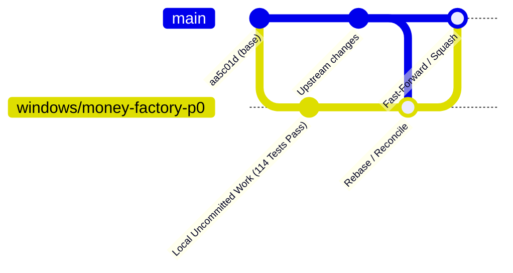

# BRANCH TRANSITION & OWNERSHIP HYGIENE PLAN

## 1. CURRENT REPOSITORY STATUS
- **Repository**: `C:\Users\lol\2026-workspace\courier`
- **Active Branch**: `windows/money-factory-p0`
- **Base Commit (HEAD)**: `aa5c01d21c7e055c7e3b5117ded5eddc6793dde4`
- **Working Tree State**: **LOCAL & UNCOMMITTED**
- **Verification Level**: **PRODUCTION_INTEGRATION_VERIFIED** (114/114 tests PASS)
- **Active Writer Leases**: 0
- **Background Tasks**: 0

---

## 2. FILE CLASSIFICATION & HYGIENE

To prevent repository bloat and maintain clean source-tree boundaries, files are strictly segregated:

### A. Production Core (To Be Tracked & Committed)
These files constitute the canonical Courier runtime and governance plane:
- `courier/governance/BorderGuard.js` (Intake validation and signature verification)
- `courier/governance/PassportOffice.js` (Task passport issuance and token minting)
- `courier/governance/ResourceLockEngine.js` (Hierarchical path and NTFS locks)
- `courier/governance/AuditLedger.js` (Append-only tamper-evident event log)
- `courier/governance/CompletionGovernor.js` (Mission continuation & terminal gatekeeper)
- `courier/governance/RestartReconciler.js` (Deterministic crash recovery)
- `courier/supervisor/decision_engine.js` (Choke point hardening & real PID inspection)
- `courier/supervisor/lease_manager.js` (Fencing of uncertain tasks & machine leases)
- `courier/supervisor/index.js` (Supervisor plane orchestration)
- `courier/tests/test_mandatory_scenarios_suite.js` (Comprehensive governance test suite)
- `courier/DAILY_IMPROVEMENT_CONTRACT.md` (Daily evolution contract)
- `courier/BRANCH_TRANSITION_PLAN.md` (Branch and commit hygiene guide)
- `courier/POST_CANARY_FIRST_EUR5_MISSION.md` (Economic canary specification)

### B. Ephemeral & Scratch Artifacts (Git-Ignored / Review-Only)
These files serve as point-in-time proof for human review and should not pollute the main commit history:
- `courier/scratch/*` (Shadow experiments, temporary execution scripts, patches)
- `courier/REAL_PATH_TRACE.jsonl` (Canary execution trace)
- `courier/BYPASS_ATTACK_REPORT.json` (19-vector penetration audit)
- `courier/COMPLETION_SEMANTICS_PROOF.json` (Four-invariant completion proof)
- `courier/fixtures/immutable_proof_fixture.txt` (Static canary proof fixture)

---

## 3. SAFE REBASE & INTEGRATION STRATEGY



1. **Isolation Guarantee**: The Mac environment is currently executing another writer mission. All changes on Windows remain strictly within `windows/money-factory-p0`.
2. **Rebase Protocol**: When synchronizing with upstream `main`, perform an interactive rebase (`git rebase origin/main`) to linearize history.
3. **No Lease Collision**: Rebase operations must occur only when active writer leases are 0.

---

## 4. COMMAND SEQUENCE FOR HUMAN OPERATOR

> [!IMPORTANT]
> **AUTONOMOUS EXECUTION BLOCKED**: The autonomous agent is strictly forbidden from executing `git commit`, `git push`, or `git checkout`. The following commands are provided solely for human execution and review.

```powershell
# 1. Review status and verify no unwanted files are staged
cd C:\Users\lol\2026-workspace\courier
git status

# 2. Inspect exact diff against HEAD
git diff --stat
git diff courier/supervisor courier/governance courier/tests

# 3. Stage only canonical production files
git add courier/governance/
git add courier/supervisor/
git add courier/tests/test_mandatory_scenarios_suite.js
git add DAILY_IMPROVEMENT_CONTRACT.md
git add BRANCH_TRANSITION_PLAN.md
git add POST_CANARY_FIRST_EUR5_MISSION.md

# 4. Commit using standardized conventional commit format
git commit -m "feat(kernel): integrate minimum viable autonomy kernel and governance choke points

- Add 6 canonical governance modules in courier/governance/
- Harden supervisor choke points in lease_manager and decision_engine
- Eliminate dead code and redundant shadow duplicates
- Verify 114/114 tests passing and 19/19 bypass attacks failed-closed
- Add daily improvement contract and branch transition plan
Ref: MISSION_WINDOWS_COURIER_MINIMUM_KERNEL_REAL_PATH_PROOF_V1"

# 5. Verify local commit
git log -1 --stat
```
