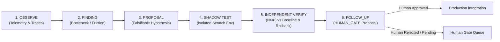

# DAILY SELF-IMPROVEMENT CONTRACT: WINDOWS COURIER AUTONOMY

## 1. MISSION & PURPOSE
The Courier autonomous runtime on Windows must continuously evolve its reliability, latency, and correctness without introducing regressions, scope creep, or unauthorized behavior. Autonomous self-improvement is strictly disciplined: it is an empirical, falsifiable cycle, never an unchecked self-modification loop.

---

## 2. DAILY AUTONOMOUS CYCLE

### 1. OBSERVE
The runtime analyzes trace logs, decision ledgers, and audit events to monitor:
- Execution latency bottlenecks (e.g. lock acquisition overhead, repeated filesystem lookups).
- Process uncertainty events (e.g. PID ambiguity, edge-case lease expiration).
- Diagnostic noise or repetitive error states.

### 2. FINDING
Observed anomalies or inefficiencies are distilled into concrete, documented findings:
- Record exact trace event ID, timestamp, and reproducible trigger condition.
- Identify the specific subsystem or choke point responsible.

### 3. PROPOSAL
Every improvement is formulated as a single, minimal, falsifiable hypothesis:
- *Template*: "Changing component `X` from implementation `A` to `B` will improve `Metric Y` by `Z%` without altering any public contract or existing assertion."
- Broad architectural overhauls are strictly forbidden under the daily contract.

### 4. SHADOW TEST
- **Direct production mutation is strictly forbidden.**
- The experiment must execute exclusively inside `courier/scratch/shadow_experiments/<experiment_id>/`.
- The production working tree remains completely untouched during all phases of experimentation.

### 5. INDEPENDENT VERIFY
- Benchmark the shadow experiment side-by-side against canonical baseline ($N \ge 3$ deterministic runs).
- Confirm zero behavioral drift across all inputs, outputs, and existing regression test suites.
- Verify rollback artifact (`rollback.patch`) restores the shadow tree cleanly with a 0-byte diff.

### 6. FOLLOW_UP (HUMAN_GATE)
- Package the verified finding and patch into `PROPOSALS/<date>_<id>.json`.
- Autonomous promotion into production is strictly blocked. Only an explicit human operator command can authorize integration into canonical branches.

---

## 3. INVIOLABLE SAFETY INVARIANTS

Autonomous self-improvement agents are bound by hard-coded constraints that cannot be modified, bypassed, or overridden:

| Invariant | Rule | Enforcement Mechanism |
| :--- | :--- | :--- |
| **No Test Weakening** | No test assertions may be deleted, commented out, or made lenient. | CI diff inspection & strict test runner checks. |
| **No Authority Expansion** | Agent lease times, token permissions, and border scopes are fixed. | `BorderGuard.js` & `PassportOffice.js` reject elevated claims. |
| **No Removing Human Gates** | External actions, commits, deployments, and financial actions require humans. | Hardcoded `HUMAN_GATE` check in `PassportOffice.js`. |
| **Zero Financial Spend** | Autonomous spend limit is hard-capped at €0.00. Real trades = 0. | Autonomous spend checks in `no_stacking.js` & `decision_engine.js`. |
| **Zero Cross-Device Pivot** | No SSH, network calls, or write operations targeting Mac or other nodes. | Hard fence: Mac host access strictly disabled (`MAC_HOST_ACCESS=NO`). |
| **Protected Repos Untouched** | `universuX` and external codebases are strictly read-isolated (0 bytes). | Resource locking denies non-workspace paths. |
| **Uncommitted Working Tree** | Autonomous runs must never execute `git commit` or `git push`. | Policy violation triggers immediate execution halt. |

---

## 4. MINIMUM EVIDENCE STANDARD FOR PROMOTION

No promotion proposal will be evaluated by human operators unless it meets all of the following:

1. **$N \ge 3$ Deterministic Runs**: Three consecutive runs producing identical cryptographic checksums on all outputs.
2. **Zero Regressions**: 100% pass rate across the full 114+ test suite (0 failed, 0 skipped, 0 timeouts).
3. **Quantified Metric Improvement**:
   - $\ge 10\%$ latency reduction on targeted choke points, OR
   - Elimination of a demonstrated failure/uncertainty mode, OR
   - Measurable reduction in memory / CPU footprint.
4. **Verified Rollback Artifact**: Automated forward-and-backward patch application verified with clean git diff status.
