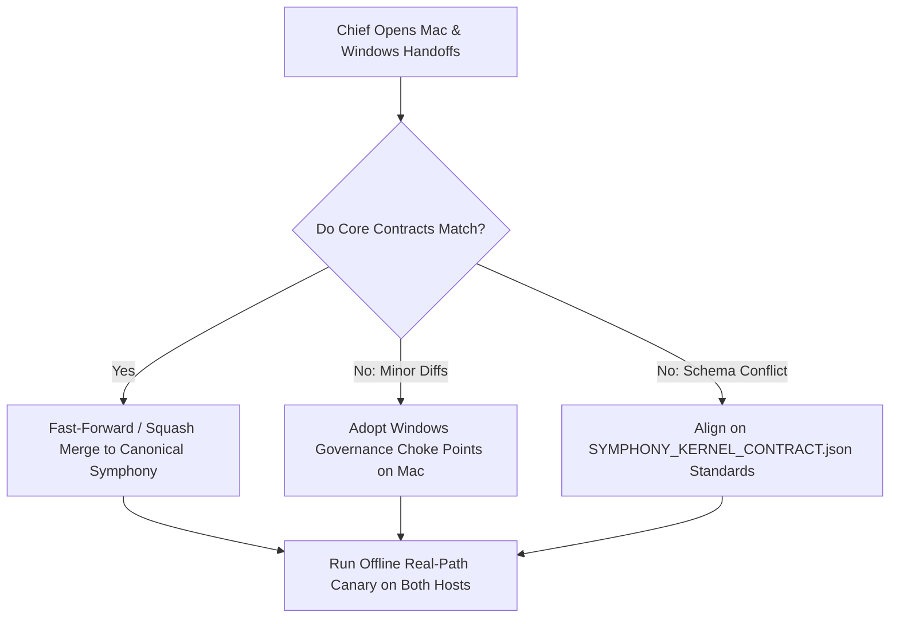

# MAC CONVERGENCE CHECKLIST

> [!IMPORTANT]
> **OPERATOR INSTRUCTION**: This checklist is designed strictly for **Chief review** once the Mac autonomous writer completes its current execution.
> **DO NOT** execute these checks automatically against the Mac host.
> **DO NOT** connect, SSH, or dispatch commands to the Mac host while it is active.

---

## 1. Core Runtime & Lifecycle Invariants

| Invariant Area | Windows Implementation (Verified) | Mac Implementation Check (To Compare) | Convergence Question |
| :--- | :--- | :--- | :--- |
| **Task Lifecycle** | Strict 12-stage pipeline: Intake $\to$ Plan $\to$ Lock $\to$ Lease $\to$ Passport $\to$ Border $\to$ Worker $\to$ Envelope $\to$ Customs $\to$ Governor $\to$ Release $\to$ Audit. | Check `runtime/core` or equivalent supervisor pipeline. | Does Mac share the identical 12-stage lifecycle from intake to terminal audit? |
| **No-Stacking Invariant** | `supervisor/no_stacking.js` prevents duplicate concurrent execution of identical work units or machine leases. | Inspect lock acquisition & queue dispatch logic. | Does Mac enforce strict single-writer mutexes preventing simultaneous duplicate task execution? |
| **Execution Uncertainty** | Crashed or unconfirmed tasks transition to `EXECUTION_UNCERTAIN`. Retries and fallbacks are strictly fenced until operator review. | Inspect crash recovery in lease manager / supervisor. | Does Mac treat mid-flight unconfirmed crashes as `EXECUTION_UNCERTAIN` rather than naively auto-retrying? |
| **Independent Terminal Evidence** | Physical disk existence and SHA-256 checksums verified by `ResultCustoms.js` before accepting completion. | Check evidence validation routines. | Does Mac independently verify disk artifacts and checksums, or rely on worker exit codes alone? |
| **Human Gate Semantics** | Hardcoded fail-closed barrier in `PassportOffice.validateHumanGateRequirement` and `SafetyGateManager.checkOperation`. | Inspect external communication & deployment triggers. | Does Mac require explicit human approval before any external side effect, publication, or payout setup? |
| **Goal-Scoped Pending Semantics** | In-flight work and pending queues are strictly partitioned by `goal_id`. | Check candidate queue and state projection. | Are pending and active tasks scoped to specific goal contexts without cross-goal contamination? |
| **Result Customs Semantics** | `ResultCustoms.js` validates task version matching, exit codes, token identity, and tamper-evident manifest. | Inspect post-execution customs gate. | Does Mac validate result envelopes against the exact version and token issued in the dispatch passport? |
| **Process Identity Contract** | Tuple: `PID` + `START_TIME_EPOCH` (delta $\le 2000$ms) + `TASK_TOKEN`. Recycled PIDs and UNKNOWN identities fail closed. | Check process management & lease tracking. | Does Mac bind process identity to start times and tokens to prevent killing recycled PIDs? |

---

## 2. Cross-Platform Delta & Capability Analysis

### A. Mac-Native Capabilities
- [ ] Are there macOS-native APIs (e.g. Darwin launchctl, keychain integration, native notification daemons) that Mac implements which Windows cannot execute?
- [ ] If present, are they cleanly isolated behind platform adapters (e.g. `platform/darwin/` vs `platform/win32/`)?

### B. Windows Fixes to Verify on Mac
- [ ] **NTFS Case-Insensitive Path Normalization**: Did Mac implement case normalization, or does it assume Unix case-sensitivity that breaks on NTFS?
- [ ] **Dead PID Reconciliation**: Does Mac handle dead worker process cleanup without raising unhandled exceptions?
- [ ] **Worker DONE Revocation**: Does Mac reject worker reports claiming global mission `DONE` (`CompletionGovernor.js`)?

### C. Conflicting Authority Implementations
- [ ] Does Mac declare alternative modules for `ResourceLockManager`, `ProcessLeaseManager`, or `AuditLedger`?
- [ ] Which implementation is canonical for cross-platform execution?
- [ ] Rule: Consolidate onto the single contract defined in `SYMPHONY_KERNEL_CONTRACT.json`.

### D. Schema & Version Compatibility
- [ ] Do `TaskPassport` schemas match across platforms?
- [ ] Are JSONL audit event types and fields identical?
- [ ] Is the evidence envelope specification (`ResultEnvelope`) binary-compatible?

---

## 3. Recommended Chief Decision Matrix

