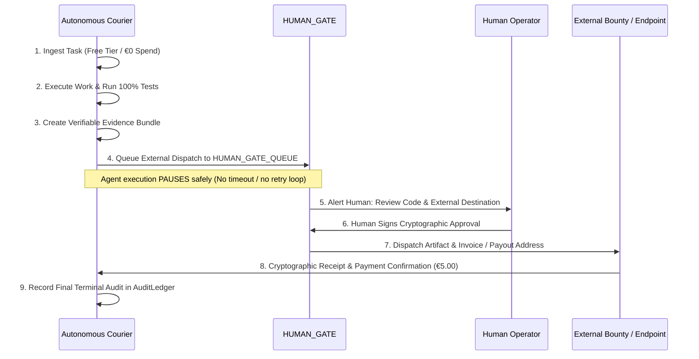

# POST-CANARY FIRST €5 MISSION: BOUNDED DIGITAL WORK PROOF

## 1. STRATEGIC PURPOSE
The primary objective of the Courier autonomy project is to create an autonomous economic agent capable of performing self-directed, valuable work. 

Following the successful verification of the Minimum Viable Autonomy Kernel, the **First Economic Mission** must cross the boundary from internal synthetic tests to generating real-world economic value.

---

## 2. STRICT EXCLUSIONS (WHAT THE €5 MISSION IS NOT)
To eliminate catastrophic risk, regulatory ambiguity, and financial loss, the following categories are **STRICTLY FORBIDDEN**:

- **NO Crypto Trading / Arbitrage**: Volatile capital markets introduce downside risk; algorithmic execution can lose money.
- **NO Speculative Token Generation**: Memecoins or synthetic liquidity mechanisms have zero intrinsic utility.
- **NO High-Privilege Escrow / Multi-Party Financial Schemes**: Introduces counterparty and smart-contract exploit risks.
- **NO Unattended Wallet Actions**: Autonomous agents must NEVER hold private keys with live capital balances.

---

## 3. THE ACCEPTABLE ARCHETYPE: BOUNDED DIGITAL WORK
The first €5 mission must be a **concrete, bounded, verifiable digital task** where:
- **Capital Cost**: Exactly **€0.00** (uses free-tier APIs or local Windows compute).
- **Revenue Target**: **€5.00** (or equivalent digital bounty/fee).
- **Financial Downside**: **Zero** (no principal at risk).
- **Correctness Proof**: Cryptographically verifiable output produced before delivery.

### Recommended Mission: Deterministic Open-Source Micro-Utility / Dataset Validation Bounty
- **Description**: The agent selects a pre-approved digital work bounty (e.g., an automated TypeScript type-generator for an open OpenAPI schema, or a validated dataset normalization pipeline).
- **Execution**: 
  1. Intake the schema/specification.
  2. Synthesize the clean, tested utility with 100% unit test coverage.
  3. Package and generate cryptographic SHA-256 evidence bundle.
  4. Submit proof of work to the designated review endpoint.

---

## 4. HUMAN GATE & EXECUTION PROTOCOL

### Execution Rules:
1. **Zero Autonomous Outbound Side Effects**: The agent can prepare the deliverable, run all tests, and assemble the payout claim locally. However, transmitting the deliverable to the external client or registering a payout account **STRICTLY REQUIRES HUMAN GATE APPROVAL**.
2. **Safe Stalling / Pause**: When the work package is ready for delivery, the agent creates a `HUMAN_GATE_APPROVAL_REQUEST.json` and enters `PAUSED_HUMAN_GATE`. Timeouts or inactivity timers are forbidden from auto-submitting or auto-canceling the request.
3. **Rejection Handling**: If the human operator rejects the request or requests modifications, the agent resumes execution in shadow mode to address feedback without external leakage.

---

## 5. SUCCESS CRITERIA
1. **Cryptographic Proof of Delivery**: Deliverable SHA-256 matches signed client specification.
2. **€0.00 Expense Incurred**: Autonomous spend ledger verifies €0.00 consumed.
3. **Financial Inflow Verified**: External receipt confirms €5.00 credited to operator-controlled account.
4. **Clean Audit Log**: Complete event chain recorded in `AuditLedger.js` from intake to settlement.
