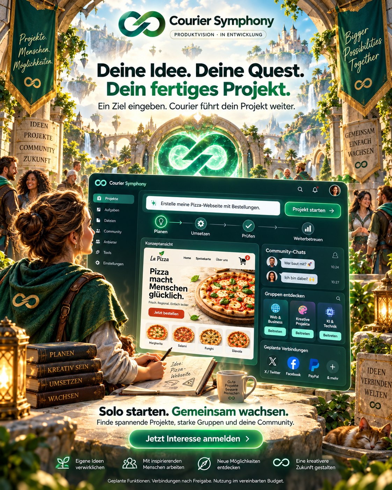

# Courier Symphony: solo starten, gemeinsam wachsen

Status: additive Produktvision und Kampagnenentwurf, 24. September 2026.
Dies ist kein Nachweis ausgelieferter Funktionen und kein neuer Runtime-Auftrag.
Der bestehende Courier-Kern und sein Release-Checkpoint bleiben maßgeblich.

## Der erste Nutzer ist eine einzelne Person

Eine Person beschreibt ihr gewünschtes Ergebnis. Courier soll daraus einen
dauerhaften Auftrag machen, die Ausführung koordinieren, Ergebnisse prüfen,
nach Unterbrechungen fortsetzen und vereinbarte Folgeaufgaben betreuen.
Ein Team oder eine Community ist dafür keine Voraussetzung.

**Produktziel: Beschreibe dein Ziel. Courier arbeitet weiter, bis das Ergebnis
geprüft ist.**

Der bestehende Ansatz bleibt erhalten: Goal -> Planung -> Ausführung ->
unabhängige Prüfung -> nächste erforderliche Arbeit bzw. bestätigter Abschluss.
„Fertig“ bezieht sich auf vereinbarte, überprüfbare Anforderungen.
Fortlaufende Betreuung ist ein ausdrücklich vereinbarter Auftrag mit Budget,
Umfang und Berechtigungen. Ein beendeter Chat beendet nicht den Auftrag.

## Gemeinschaft als freiwillige Erweiterung

Workspaces ergänzen den Solo-Einstieg. Nutzer können Gruppen gründen, passenden
Communities beitreten, interessante Projekte entdecken und Mitwirkende finden.
Community-Chats unterstützen Austausch, Fragen und Zusammenarbeit.
Private Aufträge bleiben privat, bis die berechtigte Person sie freigibt.

Die Vision einer Mitgliedschaft ohne feste Tarifgrenze ist keine Zusage
unbegrenzter gleichzeitiger Nutzung, unbegrenzten Speichers oder kostenloser
Rechenleistung. Nutzerzahl und Ressourcenverbrauch werden getrennt betrachtet.

## Geplante Verbindungen

- **X / Twitter und Facebook:** eigene freigegebene Konten mit geeigneten
  Projektabläufen verbinden. Die genaue API-Verfügbarkeit und Plattformregeln
  werden vor Umsetzung geprüft. Keine bereits fertige Integration behaupten.
- **PayPal:** späterer Zahlungsablauf über das berechtigte Händlerkonto;
  zunächst Testumgebung, bevor echte Zahlungen aktiviert werden.
- **Weitere Tools und KI-Anbieter:** bestehende Provider-/Slot-Idee erweitern,
  ohne Quoten, Konto- oder Berechtigungsgrenzen zu umgehen.

Verbindungen bedeuten weder automatische Veröffentlichung noch die Erlaubnis,
Nachrichten zu senden, Zahlungen auszulösen oder fremde Konten zu verwenden.
Die Freigaben sollen im Produkt verständlich und passend zur konkreten Aktion sein.

## Das Pizza-Beispiel erklärt den Nutzen

Eingabe: „Erstelle meine Pizza-Webseite mit Bestellungen.“

Der spätere Pilot muss einen überprüfbaren Ablauf zeigen: Angebot und Webseite,
Bestellvorgang, Zahlungsbestätigung, Übergabe an Küche/Lieferpartner sowie
vereinbarte Betriebsprüfungen. Tatsächliche Zubereitung und Lieferung benötigen
den ausführenden Betrieb bzw. Lieferpartner. Eine schöne Webseite allein ist
kein Beleg für diesen gesamten Ablauf.

## Gestaltung: eine kreative Abenteuerwelt

Das Endloszeichen bleibt der Markenanker. Eine eigenständige Fantasy-Welt mit
Portalen, Projekt-Quests, Gruppen und sichtbarem Fortschritt macht den Einstieg
spielerisch. Keine Figuren, Logos oder Benutzeroberflächen eines bestehenden
Spiels kopieren. Die tatsächlichen Softwarefunktionen bleiben gut erkennbar.

Für ein jüngeres Publikum sind verständliche Sprache, Privatsphäre, Moderation,
Melden/Blockieren, kontrollierbare Gruppenbeitritte und transparente Kosten
vorzusehen. Keine Druckmechanismen, Glücksspielmechaniken oder Kaufanreize
für Minderjährige. Die Zielgruppe und erforderlichen Schutzmaßnahmen müssen
vor einer entsprechenden Veröffentlichung geklärt werden.

Fortschritt im Produkt muss auf realen Ergebnissen beruhen; dekorative
Fortschrittsanzeigen dürfen keinen erfolgreichen Auftrag vortäuschen.

## Verkaufstext zum Bild

**Deine Idee. Deine Quest. Dein fertiges Projekt.**

Du hast eine Idee? Courier Symphony soll daraus ein fertiges, geprüftes
Projekt machen – und die Arbeit über einzelne Chats hinaus weiterführen.

Starte allein mit deinem Ziel. Entdecke spannende Projekte, gründe eigene
Gruppen oder schließe dich einer Community an. Tausche dich in Community-Chats
aus und finde Menschen, mit denen du gemeinsam mehr umsetzen kannst.

Geplant sind Verbindungen zu X / Twitter, Facebook, PayPal sowie weiteren Tools
und KI-Anbietern. Alles in einer kreativen Welt, die sich wie ein Abenteuer
anfühlt und echte Projekte voranbringen soll.

**Solo starten. Gemeinsam wachsen. Jetzt Interesse anmelden.**

Courier Symphony befindet sich in Entwicklung. Gezeigte Funktionen und
Integrationen sind Produktvision; Nutzung innerhalb vereinbarter Freigaben
und Budgets. #CourierSymphony #KI #Community #Projekte #SoloCreator

## Herkunft und Abgrenzung

Das Bild wurde mit der integrierten Bildgenerierung erstellt. Die bestehende
Courier-Grafik diente als Markenreferenz. Der [Bildprompt](IMAGE_PROMPT_2026-09-24.md)
ist beigefügt. Das Motiv ist eine Konzeptansicht, kein Screenshot des aktuellen
Produkts. Bewusst keine bisher unvalidierten Preise in dieser Kampagnenversion.

Diese Datei erweitert die Kommunikation zum [Sales Starter Kit](../SALES_STARTER_KIT.md)
und zur [bestehenden Community-Produktidee](../DEFERRED_PRODUCT_PLATFORM_AND_REVENUE_PLAYBOOK_2026-09-10.md).
Sie ersetzt weder diese Dokumente noch den [Release-Checkpoint](../RELEASE_CANDIDATE.md).
Keine neue Scheduler-Instanz, kein Provider-Auftrag und keine Änderung an
Produktionscode oder Laufzeitdaten gehören zu dieser Dokumentationserweiterung.
