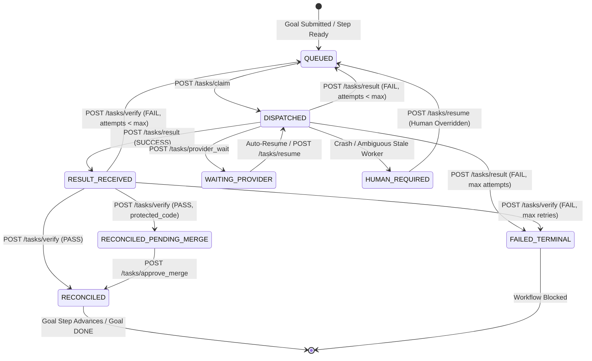

# Courier Central API Reference

The Courier Central API is the authoritative coordination plane for the Courier multi-worker platform. Operating as a hardened, lightweight service (defaulting to port `8080` / `8081`), the central API coordinates goal decomposition, task lifecycle transitions, worker registrations, atomic dispatching, and independent verification across heterogeneous platforms (macOS, Windows, and Linux).

---

## Architecture & Design Principles

The Courier Central API is designed around fail-closed distributed systems guarantees:

- **Durable Identity Binding**: Every execution traces through a strictly ordered identity chain:
  $$\text{goal\_id} \longrightarrow \text{task\_id} \longrightarrow \text{attempt\_id} \longrightarrow \text{dispatch\_id} \longrightarrow \text{execution\_ref} \longrightarrow \text{result\_id} \longrightarrow \text{attestation\_id}$$
- **Two-Phase Execution & Verification**: Worker success does not advance workflow state. A separate, authenticated verifier process must independently inspect generated artifacts and post a `PASS` verdict. Producers can never verify their own work (`producer_principal != verifier_principal`).
- **Atomic State Transitions**: Central state (`central_state.json`) is managed through thread-safe in-process mutexes (`STATE_LOCK`) and atomic file-system writes (`fsync` followed by atomic rename).
- **Anti-Collision & Resource Leases**: Exclusive resources (`exclusive_resources`) are locked during task execution and released upon task reconciliation or failure.
- **Fail-Closed Security**: Insecure default keys (`dev-secret-key`), mismatched Git SHAs, or missing principal credentials fail closed with HTTP 401, 403, 426, or 503.

---

## Authentication & Security Model

The Central API distinguishes between standard worker operations and privileged verification/governance operations:

| Credential Header | Environment Variable | Role & Permissions |
| :--- | :--- | :--- |
| `Authorization: Bearer <API_KEY>` | `COURIER_API_KEY` | Worker registration, heartbeats, task claims, result submissions, goal queries. |
| `Authorization: Bearer <VERIFIER_KEY>` | `COURIER_VERIFIER_API_KEY` | Verification queue inspection, result verification (`/tasks/verify`), merge approvals. |

> [!IMPORTANT]
> The server enforces key segregation: `COURIER_VERIFIER_API_KEY` must not match `COURIER_API_KEY`. If keys are identical, missing, or set to insecure defaults (`dev-secret-key`), the server refuses requests with `503 Service Unavailable`.
>
> In addition, the central server computes cryptographic SHA-256 fingerprints of authorization tokens (`principal_<sha256>`) to ensure non-repudiation and verify that a worker does not certify its own deliverables.

---

## Canonical Task State Machine

A task moves through a strictly validated finite state machine. Invented or out-of-order statuses are rejected by the runtime.



### Valid Task Status Values

- `QUEUED`: Task is pending claim by an eligible worker.
- `DISPATCHED`: Claimed by a registered worker and currently executing.
- `RESULT_RECEIVED`: Worker completed execution and submitted a durable result; awaiting independent verification.
- `RECONCILED`: Result verified and accepted; dependencies unlocked and goal step advanced.
- `RECONCILED_PENDING_MERGE`: Verified artifact touches protected code; awaiting human or verifier merge approval.
- `WAITING_PROVIDER`: Execution paused due to external API provider rate limits or upstream quota locks.
- `BLOCKED_TRANSIENT`: Temporary transport or environment blockage subject to backoff retry.
- `HUMAN_REQUIRED`: Ambiguous failure, worker crash with potential external side effects, or human gate required.
- `FAILED_VERIFICATION`: Artifact rejected during verification.
- `FAILED_TERMINAL`: Permanent failure after exhausting retry quotas.

---

## API Endpoints Reference

### 1. Health & Server Status

#### `GET /health`
Public liveness and health probe.
- **Auth**: None
- **Response**: `200 OK`
```json
{
  "status": "healthy",
  "time": 1774431155.12
}
```

#### `GET /status`
High-level summary of active system entities.
- **Auth**: `COURIER_API_KEY`
- **Response**: `200 OK`
```json
{
  "goals": 12,
  "active_goals": 2,
  "tasks": 48,
  "workers": 4
}
```

---

### 2. Goal Management

#### `POST /goals`
Submit a new orchestration goal. If an explicit `workflow_plan` is omitted, the central API invokes the `ChiefCommander` planner to automatically decompose the instruction into platform-specific tasks.
- **Auth**: `COURIER_API_KEY`
- **Request Body**:
```json
{
  "goal_text": "Generate a 10-file documentation site for Courier to prove multi-worker orchestration.",
  "terminal": true,
  "workflow_plan": [
    {
      "task_id": "TASK-DOC-1",
      "instruction": "Create docs/public_site/index.md",
      "required_capabilities": ["mac"],
      "artifacts": ["docs/public_site/index.md"]
    },
    {
      "task_id": "TASK-DOC-2",
      "instruction": "Create docs/public_site/setup.md",
      "required_capabilities": ["windows"],
      "depends_on": ["TASK-DOC-1"],
      "artifacts": ["docs/public_site/setup.md"]
    }
  ]
}
```
- **Response**: `200 OK`
```json
{
  "goal_id": "goal-49a1f89c",
  "status": "ACTIVE"
}
```

#### `GET /goals/<goal_id>`
Retrieve the status of a specific goal and all associated tasks.
- **Auth**: `COURIER_API_KEY`
- **Response**: `200 OK`
```json
{
  "goal": {
    "goal_id": "goal-49a1f89c",
    "goal_text": "Generate documentation site",
    "status": "ACTIVE",
    "current_step_index": 1,
    "workflow_plan": [...]
  },
  "tasks": [...]
}
```

#### `GET /walls`
Lists all goals that are blocked and require human intervention or recovery.
- **Auth**: `COURIER_API_KEY`
- **Response**: `200 OK`
```json
{
  "goal-49a1f89c": {
    "goal_id": "goal-49a1f89c",
    "status": "BLOCKED",
    "blocker": "Human review required"
  }
}
```

---

### 3. Worker Node Lifecycle

#### `POST /workers/register`
Registers a worker daemon with the central orchestrator. Checks that the worker's Git SHA matches the server's runtime SHA.
- **Auth**: `COURIER_API_KEY`
- **Request Body**:
```json
{
  "worker_id": "MAC-WORKER-01",
  "platform": "mac",
  "capabilities": ["mac", "macos", "posix"],
  "authorities": ["local_exec"],
  "provider": "gemini",
  "capacity_identity": "account-standard-1",
  "provider_available": true,
  "capacity_available": true,
  "cost_class": "free",
  "runtime_sha": "a1b2c3d4e5f6..."
}
```
- **Response**: `200 OK` (`{"status": "REGISTERED"}`) or `426 Upgrade Required` on SHA mismatch.

#### `POST /workers/heartbeat`
Keep-alive ping sent periodically by workers.
- **Auth**: `COURIER_API_KEY`
- **Request Body**:
```json
{
  "worker_id": "MAC-WORKER-01"
}
```
- **Response**: `200 OK` (`{"status": "OK"}`)

#### `POST /workers/unregister`
Deregisters or gracefully disconnects a worker node.
- **Auth**: `COURIER_API_KEY`
- **Request Body**:
```json
{
  "worker_id": "MAC-WORKER-01"
}
```
- **Response**: `200 OK` (`{"status": "UNREGISTERED"}`)

#### `GET /workers`
Lists all currently registered workers and their availability status.
- **Auth**: `COURIER_API_KEY`

---

### 4. Task Dispatch & Execution

#### `POST /tasks/claim`
Poll for the next eligible task matching the worker's capabilities, authorities, cost order, and resource availability.
- **Auth**: `COURIER_API_KEY`
- **Request Body**:
```json
{
  "worker_id": "MAC-WORKER-01"
}
```
- **Response (Task Available)**: `200 OK`
```json
{
  "task": {
    "task_id": "TASK-DOC-3",
    "goal_id": "goal-49a1f89c",
    "attempt_id": "TASK-DOC-3:attempt:1",
    "dispatch_id": "dispatch-047b7190",
    "execution_ref": "exec-6d9b2e7a",
    "instruction": "Create docs/public_site/api.md containing an overview of the Courier central API.",
    "status": "DISPATCHED",
    "worker_id": "MAC-WORKER-01",
    "target_capability": "mac",
    "server_binding": {
      "sha": "a1b2c3d4...",
      "runtime": "courier-server:..."
    }
  }
}
```
- **Response (No Work Available)**: `200 OK` (`{"task": null}`)

#### `POST /tasks/result`
Submits durable proof of task execution. Must include the exact dispatch identity chain and cryptographic hashes of generated artifacts.
- **Auth**: `COURIER_API_KEY`
- **Request Body**:
```json
{
  "goal_id": "goal-49a1f89c",
  "task_id": "TASK-DOC-3",
  "attempt_id": "TASK-DOC-3:attempt:1",
  "dispatch_id": "dispatch-047b7190",
  "execution_ref": "exec-6d9b2e7a",
  "worker_id": "MAC-WORKER-01",
  "run_id": "proc-94182",
  "result_id": "result-389f41bc",
  "status": "SUCCESS",
  "artifacts": [
    {
      "path": "docs/public_site/api.md",
      "sha256": "4b68e910..."
    }
  ],
  "runtime_identity": {
    "sha": "a1b2c3d4...",
    "runtime": "courier-server:..."
  }
}
```
- **Response**: `200 OK` (`{"status": "ACK_RESULT_RECEIVED"}`)

#### `POST /tasks/<task_id>/provider_wait`
Informs the server that an external provider interrupted execution (e.g. rate limit). Moves task to `WAITING_PROVIDER` without consuming an execution retry attempt.
- **Auth**: `COURIER_API_KEY`
- **Request Body**:
```json
{
  "worker_id": "MAC-WORKER-01",
  "reason": "RATE_LIMIT_EXCEEDED",
  "wait_type": "WAITING_PROVIDER"
}
```
- **Response**: `200 OK` with exponential backoff calculation and provider lock timestamp.

#### `POST /tasks/<task_id>/resume`
Resumes a blocked, failed, or rate-limited task. Supports transport retries or re-execution with optional instruction overrides.
- **Auth**: `COURIER_API_KEY`
- **Request Body**:
```json
{
  "action": "retry",
  "instruction_override": "Updated bounded instruction"
}
```

#### `POST /tasks/reclaim_stale`
Sweeps the worker registry for nodes that have not reported a heartbeat within 300 seconds. Tasks stranded on stale workers are safely quarantined to `HUMAN_REQUIRED` to avoid duplicate side effects.
- **Auth**: `COURIER_API_KEY`

---

### 5. Independent Verification & Governance

#### `GET /tasks/pending_verification`
Returns all tasks currently in `RESULT_RECEIVED` status awaiting independent inspection.
- **Auth**: `COURIER_VERIFIER_API_KEY`
- **Response**: `200 OK`
```json
{
  "tasks": [ ... ]
}
```

#### `POST /tasks/verify`
Submits an authoritative verdict for a completed task. Producer and verifier principals must differ.
- **Auth**: `COURIER_VERIFIER_API_KEY`
- **Request Body**:
```json
{
  "task_id": "TASK-DOC-3",
  "result_id": "result-389f41bc",
  "verifier_id": "VERIFIER-NODE-01",
  "verdict": "PASS",
  "artifacts": [
    {
      "path": "docs/public_site/api.md",
      "sha256": "4b68e910..."
    }
  ],
  "received_runtime_identity": {
    "sha": "a1b2c3d4...",
    "runtime": "courier-server:..."
  }
}
```
- **Response**: `200 OK` (`{"status": "RECONCILED"}`)

#### `GET /attestations/<attestation_id>`
Retrieves a cryptographically signed attestation receipt generated after successful verification.
- **Auth**: `COURIER_API_KEY`
- **Response**: `200 OK`
```json
{
  "attestation_id": "9081e3ad4...",
  "goal_id": "goal-49a1f89c",
  "task_id": "TASK-DOC-3",
  "attempt_id": "TASK-DOC-3:attempt:1",
  "dispatch_id": "dispatch-047b7190",
  "result_id": "result-389f41bc",
  "result_sha256": "8f3b201a...",
  "producer_principal": "principal_worker_...",
  "verifier_principal": "principal_verifier_...",
  "verdict": "PASS",
  "verified_at": 1774431250.4
}
```

#### `POST /tasks/<task_id>/approve_merge`
Human gate approval required for tasks with `merge_scope: protected_code`. Enforces hygiene policies (e.g. rejects unauthorized libraries like `requests` or core security modifications).
- **Auth**: `COURIER_VERIFIER_API_KEY`
- **Request Body**:
```json
{
  "approver": "security-lead",
  "merge_ref": "refs/heads/main"
}
```

---

### 6. Batch Queue Operations

For large-scale, sequenced batch workflows stored in `events/queue/`:

| Method | Endpoint | Description |
| :--- | :--- | :--- |
| `GET` | `/batches` | Lists all active and completed batch queue files. |
| `GET` | `/batches/<batch_id>` | Returns full batch item manifest and metadata. |
| `GET` | `/batches/<batch_id>/active` | Returns the currently active/in-progress item. |
| `GET` | `/batches/<batch_id>/next` | Returns the next queued item whose dependencies are met. |
| `GET` | `/batches/<batch_id>/blocked` | Returns items blocked by quotas, transient errors, or human gates. |

---

## Standard Error Codes

The Central API returns explicit HTTP status codes alongside JSON error descriptors:

| Status Code | Reason | Cause / Remediation |
| :--- | :--- | :--- |
| `400 Bad Request` | Contract violation | Missing required identity fields, invalid status transition, or malformed JSON. |
| `401 Unauthorized` | Invalid / missing credentials | Missing `Authorization: Bearer <TOKEN>` or invalid token provided. |
| `403 Forbidden` | Authority / provenance failure | Verifier attempted self-certification (`producer == verifier`), or token lacks authority. |
| `404 Not Found` | Unknown resource | Specified `goal_id`, `task_id`, or `worker_id` does not exist in state. |
| `409 Conflict` | Contradictory replay | Attempting to submit a contradictory result or replay state for an already reconciled task. |
| `426 Upgrade Required` | Source SHA mismatch | Worker runtime Git SHA differs from the server's authoritative HEAD commit. |
| `503 Service Unavailable` | Insecure configuration | Server API keys are not configured or set to default insecure values (`dev-secret-key`). |

---

## Integration Example (Python)

Below is an end-to-end Python snippet illustrating how a worker interacts with the Central API:

```python
import os
import requests

API_URL = os.environ.get("COURIER_URL", "http://127.0.0.1:8080")
API_KEY = os.environ.get("COURIER_API_KEY")
HEADERS = {"Authorization": f"Bearer {API_KEY}"}

# 1. Register worker
worker_reg = {
    "worker_id": "MAC-01",
    "platform": "mac",
    "capabilities": ["mac", "macos"],
    "authorities": ["local_exec"],
    "cost_class": "free"
}
requests.post(f"{API_URL}/workers/register", json=worker_reg, headers=HEADERS).raise_for_status()

# 2. Claim next available task
claim_resp = requests.post(f"{API_URL}/tasks/claim", json={"worker_id": "MAC-01"}, headers=HEADERS).json()
task = claim_resp.get("task")

if task:
    print(f"Claimed task: {task['task_id']} - {task['instruction']}")
    
    # 3. Execute instruction and produce artifact
    # ... execution logic ...

    # 4. Report durable result
    result_payload = {
        "goal_id": task["goal_id"],
        "task_id": task["task_id"],
        "attempt_id": task["attempt_id"],
        "dispatch_id": task["dispatch_id"],
        "execution_ref": task["execution_ref"],
        "worker_id": "MAC-01",
        "run_id": f"pid-{os.getpid()}",
        "result_id": f"result-{task['task_id']}",
        "status": "SUCCESS",
        "artifacts": [{"path": "docs/public_site/api.md", "sha256": "..."}],
        "runtime_identity": task["server_binding"]
    }
    requests.post(f"{API_URL}/tasks/result", json=result_payload, headers=HEADERS).raise_for_status()
```

---
*Courier Central API — Deterministic coordination for autonomous multi-worker systems.*

## P5: Product Extensions (Communities & Chats)

As part of the **P5** Phase, the Courier API provides endpoints for decentralized, ledger-backed Communities and Chats. These endpoints follow the same strict "Two-Phase Execution & Verification" guarantees.

### Communities

**`POST /api/v1/communities`**
Creates a new Community. Requires `PROVEN_EDGES` for `COMMUNITY_CREATION_AUTHORIZED`.

**`GET /api/v1/communities/:community_id`**
Retrieves the immutable community settings and current ledger state.

### Chats

**`POST /api/v1/communities/:community_id/chats`**
Initiates a new Chat session within a Community. Requires an active `exclusive_resource` lease on the Community to prevent race conditions during member ingestion.
