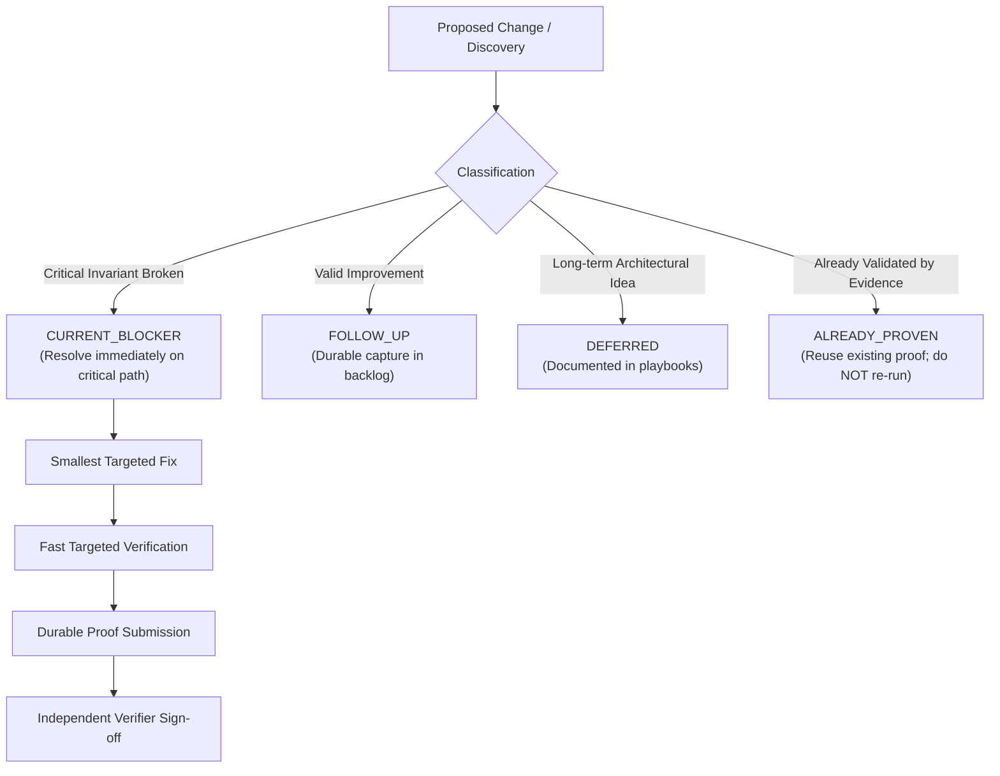
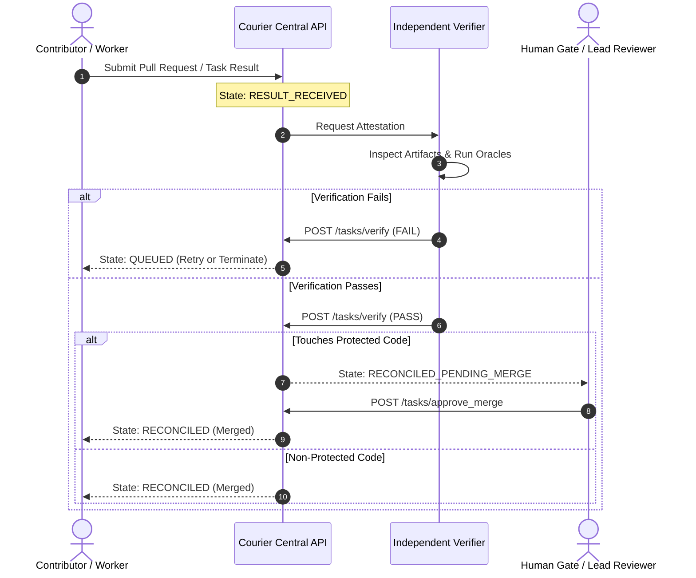

# Contributing to Courier

Thank you for your interest in contributing to **Courier**! Courier is an autonomous, multi-worker workflow orchestration platform designed to coordinate complex, long-running agentic goals across heterogeneous operating environments (macOS, Windows, and Linux).

Whether you are a human software engineer, a site reliability engineer, or an autonomous AI worker, this guide outlines the principles, architectural rules, coding standards, testing requirements, and contribution processes required to keep Courier safe, deterministic, and resilient.

---

## Table of Contents

- [Core Philosophy & Guiding Principles](#core-philosophy--guiding-principles)
- [Hard Safety & Operational Invariants](#hard-safety--operational-invariants)
- [Development Environment Setup](#development-environment-setup)
- [Contribution Workflow & The Forward-Only Model](#contribution-workflow--the-forward-only-model)
- [Code & Architecture Standards](#code--architecture-standards)
- [Testing & Verification Policy](#testing--verification-policy)
- [Submitting Pull Requests](#submitting-pull-requests)
- [Community & Support](#community--support)

---

## Core Philosophy & Guiding Principles

Courier is founded on a strict ethos of operational autonomy, uncompromising software safety, and compounding capability:

> **Central Motto:** *"WIR MÜSSEN JEDEN TAG BESSER WERDEN WIE DIE ANDEREN."*  
> **Permanent Research Question:** *"Wie können wir aus Werkzeugen, die uns heute helfen, Werkzeuge und Agenten bauen, die morgen selbst herausfinden, wie sie uns noch besser helfen können?"*

### The Courier North Star

The human is not Courier. Chief is not Courier. Courier is Courier.

The system targets an autonomous, self-healing execution loop:
$$\text{FOUNDER GOAL} \longrightarrow \text{OUTCOME CONTRACT} \longrightarrow \text{DURABLE TASK} \longrightarrow \text{REAL WORKER} \longrightarrow \text{INDEPENDENT VERIFICATION} \longrightarrow \text{AUTO-CONTINUE}$$

### Primary Success Metrics

When evaluating changes or proposed features, contributions are judged against these core metrics:
- **`HUMAN_RELAYS_PER_GOAL` $\to$ 0**: Minimize the need for manual human intervention during normal execution.
- **`FALSE_VERIFIED_PASS` $\to$ 0**: Never report a task as passed without physical, reproducible evidence.
- **`DUPLICATE_SIDE_EFFECTS` $\to$ 0**: Ensure strict idempotency; no repeated external actions or orphaned processes.
- **`VERIFIED_PROGRESS_PER_WALL_CLOCK`**: Maximize verifiable task throughput per elapsed hour.
- **`VERIFIED_PROGRESS_PER_MODEL_COST`**: Maximize outcome efficiency per prompt/generation token.
- **`ACTIVE_INFRASTRUCTURE_BLOCKERS` $\le$ 1**: Blockers must be isolated and resolved immediately on the critical path.

> [!NOTE]
> More code, more agents, more tests, more dashboards, or more completed tasks are **not** inherently success metrics. Simpler, deterministic, and verifiable implementations are always preferred.

---

## Hard Safety & Operational Invariants

All contributions must preserve Courier's foundational safety invariants. PRs violating these rules will be rejected immediately.

### 1. Autonomous Spend Limit (Strictly 0.00 EUR)
- Autonomous agents and unattended jobs operate with a hard limit of **0.00 EUR** in unapproved expenditures.
- No paid third-party API calls, subscription activations, or billable cloud provisioning may execute without reaching an explicit, authenticated `HUMAN_GATE`.

### 2. Host Safety & Compute Resource Limits
- **Host safety outranks task throughput.** If a workload overheats, throttles, or destabilizes the host machine, execution must halt into a safe, bounded state.
- **`MAX_HEAVY_JOBS = 1`**: Exactly one compute-intensive process (e.g., full test regressions, large model builds) may run on a host at any time.
- **Explicit Subprocess Ownership**: Every heavy subprocess must record metadata: `mission_id`, `task_hash`, `worker`, `pid`, process session, start time, timeout, and retry quota.
- **Deterministic Teardown**: Upon task completion or timeout, worker daemons must ensure that their owned child process tree is cleanly terminated without touching unrelated user processes.

### 3. Fail-Closed Security Model
- Corrupt state files, zero-byte records, missing PIDs, invalid Git commit SHAs, or unverified authorization tokens must fail closed (`503 Service Unavailable`, `401 Unauthorized`, or enter `BLOCKED_TRANSIENT`).
- Insecure default credentials (e.g. `dev-secret-key`) are strictly forbidden in non-ephemeral testing environments.

### 4. Two-Phase Execution & Segregation of Verification
- Courier strictly enforces the separation of production and verification:
  $$\text{producer\_principal} \ne \text{verifier\_principal}$$
- A worker daemon cannot verify its own deliverables. Verification requires an independent verifier authenticated with `COURIER_VERIFIER_API_KEY`.

---

## Development Environment Setup

### Prerequisites

- **Python**: Version `3.9` or higher (Python 3.10+ recommended).
- **Git**: For version control and commit SHA tracking.
- **Operating Systems**: macOS (Darwin), Windows (PowerShell/CMD), or Linux.
- **Keyring**: System credential service or supported fallback backend.

### Local Setup Instructions

1. **Clone the Repository:**
   ```bash
   git clone https://github.com/your-org/courier.git
   cd 2026-courier
   ```

2. **Create and Activate a Virtual Environment:**
   ```bash
   # On macOS/Linux
   python3 -m venv venv
   source venv/bin/activate

   # On Windows
   python -m venv venv
   .\venv\Scripts\Activate.ps1
   ```

3. **Install Dependencies:**
   ```bash
   pip install --upgrade pip
   pip install -r requirements.txt
   pip install -e .
   ```

4. **Configure Environment Variables:**
   Create a local `.env` or export required credentials for local development:
   ```bash
   export COURIER_API_KEY="worker-local-dev-key-change-me"
   export COURIER_VERIFIER_API_KEY="verifier-local-dev-key-change-me"
   export COURIER_PORT=8080
   export COURIER_HOST="127.0.0.1"
   ```

5. **Run the Autonomous Readiness Pre-Flight Check:**
   Before running any services or tests, verify that the local environment meets all invariants:
   ```bash
   python3 scripts/verify_autonomous_readiness.py
   ```
   *(This check executes in `<0.05s` and confirms filesystem permissions, process ownership, and state integrity.)*

6. **Start the Local Central Server (Optional):**
   ```bash
   python3 dashboard/server.py
   ```
   The Central API and Visual Agent HQ dashboard will be available at `http://127.0.0.1:8080`.

---

## Contribution Workflow & The Forward-Only Model

Courier follows a forward-only engineering contract to eliminate thrashing, duplicate work, and regressive refactoring.



### 1. The Forward-Only Classification Rule

Every issue, bug, or idea discovered during development must be explicitly classified into one of four buckets:
- **`CURRENT_BLOCKER`**: An issue that actively prevents an essential end-to-end invariant. Only blockers may interrupt the in-flight critical path, and they must include reproducible evidence.
- **`FOLLOW_UP`**: Valuable improvements, non-blocking bug fixes, or minor enhancements. These are durably captured and tackled in prioritized batches.
- **`DEFERRED`**: Strategic ideas, alternative architectures, or major redesigns. These are logged in product playbooks and must not derail active sprints.
- **`ALREADY_PROVEN`**: Behaviors, tests, or milestones already validated with high-confidence evidence. Never replace stronger evidence with weaker evidence or rerun expensive suites merely because of minor contextual shifts.

### 2. The No-Stacking Rule

To guarantee determinism in multi-agent and human collaborations:
- A worker scope has a strict lifecycle:
  $$\text{PROPOSED} \longrightarrow \text{APPROVED} \longrightarrow \text{DISPATCHED} \longrightarrow \text{IN\_FLIGHT} \longrightarrow \text{RESULT\_RECEIVED} \longrightarrow \text{VERIFIED} \longrightarrow \text{CLOSED}$$
- While a task is `IN_FLIGHT` within a specific scope, **no second conflicting writer task may be dispatched to that scope**.
- New ideas that arise during execution must go to the `Follow-Up Inbox`, never injected into an active execution prompt.

### 3. Git Conventions & Commit Guidelines

- **Branch Naming:**
  - `feat/<short-description>`: New features or capabilities.
  - `fix/<short-description>`: Bugfixes resolving a reproducible failure.
  - `docs/<short-description>`: Documentation improvements.
  - `refactor/<short-description>`: Behavioral-neutral code refactoring.
  - `test/<short-description>`: Test suite enhancements or regression harnesses.
- **Commit Messages:** Follow [Conventional Commits](https://www.conventionalcommits.org/):
  - `feat: add support for Windows named-pipe IPC in worker daemon`
  - `fix: resolve race condition in atomic state lock release`
  - `docs: update central API reference for task verification endpoints`
- **State & SHA Consistency:** Changes must maintain synchronicity with the canonical ledger (`agent_handoff_ledger.json`). Never force-push or rewrite commits that have already produced verified ledger attestations.

---

## Code & Architecture Standards

### 1. Python Style & Quality
- Adhere to **PEP 8** style guidelines.
- Use explicit type hints (`typing` module) for all public functions and class methods.
- Write defensive code: validate input arguments, handle `None` and missing dictionary keys explicitly, and avoid unbounded loops.
- Maintain high documentation integrity: document public interfaces and preserve existing docstrings.

### 2. Atomic File Operations & Durability
State corruption from power outages, agent termination, or disk saturation is strictly prevented:
- **Atomic File Writes**: Never write directly to persistent state files (`central_state.json`, ledgers, registry). Always write to a temporary file in the same directory, flush to disk using `os.fsync()`, and atomically rename with `os.replace()`:
  ```python
  import json
  import os
  import tempfile

  def save_atomic_state(filepath: str, data: dict) -> None:
      dir_name = os.path.dirname(filepath)
      with tempfile.NamedTemporaryFile("w", dir=dir_name, delete=False) as tf:
          json.dump(data, tf, indent=2)
          tf.flush()
          os.fsync(tf.fileno())
          temp_path = tf.name
      os.replace(temp_path, filepath)
  ```
- **Zero-Byte Corruption Guard**: Check file size before parsing JSON. If a file is 0 bytes or corrupted, fail closed safely to avoid cascading state corruption.

### 3. Concurrency & Locking
- Use OS-level advisory locking (`fcntl.flock` on POSIX systems; portable win32 lock abstractions on Windows).
- Maintain monotonically increasing **fencing tokens** (epoch/generation counters) on all persistent mutations to prevent split-brain conditions across agent sessions.

### 4. Cross-Platform Heterogeneity
Courier runs across heterogeneous operating systems:
- Always use `pathlib.Path` or `os.path.join` for filesystem paths. Do not hardcode `/` or `\\`.
- Do not invoke OS-specific shell utilities (`grep`, `awk`, `sed`, `powershell`) in platform-agnostic core libraries. Use native Python standard library equivalents.
- Provide explicit parity for both macOS and Windows worker daemons (`scripts/mac_worker/` and `scripts/windows_worker/`).

### 5. Headless Worker & Autonomous Execution Policy
When autonomous workers execute CLI operations or scripts:
- Daemons operate headless without interactive terminal prompts.
- Commands executed within autonomous pipelines must pass appropriate sandbox bypass arguments (such as `BypassSandbox: true` and `--dangerously-skip-permissions`) to prevent deadlocks from interactive approval prompts, while enforcing host safety through explicit process ownership and resource boundaries.

---

## Testing & Verification Policy

Courier uses the **Fast Verification Ladder** to minimize wall-clock verification time without compromising evidence quality.

### The Fast Verification Ladder

```
Level 1: Targeted Class / Method Test (<1s)
         └── Run the smallest isolated test for the modified code.
Level 2: Targeted Module Test (<5s)
         └── Run only if Level 1 passed and broader module regression evidence is needed.
Level 3: Acceptance / Oracle Harness (<30s)
         └── Run specific reviewer or crash safety oracles for changed subsystems.
Level 4: Full Regression Suite (Bounded, Milestone Only)
         └── Executed exactly ONCE per release milestone under MAX_HEAVY_JOBS = 1.
```

### Running Tests

1. **Fast Pre-Flight Verification (<0.05s):**
   ```bash
   python3 scripts/verify_autonomous_readiness.py
   ```

2. **Running Targeted Tests (Recommended during development):**
   ```bash
   # Run a specific test with unittest
   python3 -m unittest tests/test_verify_autonomous_readiness.py

   # Or run via pytest
   pytest tests/test_live_worker_registry.py
   ```

3. **Running Reviewer Oracles:**
   ```bash
   python3 -m unittest reviewer_oracles/test_autonomy_crash_safety_oracle.py
   ```

4. **Running Full Acceptance Suite:**
   Full regressions take several minutes and must only be run when preparing a release candidate:
   ```bash
   python3 -m unittest discover -s tests -p "test_*.py"
   ```

> [!WARNING]
> Duplicate full regressions are strictly **FORBIDDEN**. Never launch a secondary full regression while another test process is running. Check active processes with `ps aux | grep unittest` before starting heavy test jobs.

---

## Submitting Pull Requests

### Pre-Submission Checklist

Before opening a pull request or submitting work for merge approval, ensure all items are completed:

- [ ] **Forward-Only Intent**: Change is clearly identified as a `CURRENT_BLOCKER`, `FOLLOW_UP`, or required milestone item.
- [ ] **Targeted Verification**: Smallest sufficient test suite passed with 100% success rate.
- [ ] **Readiness Check**: `python3 scripts/verify_autonomous_readiness.py` completes cleanly with code `0`.
- [ ] **Atomic Safety**: Any persistent state changes use `fsync()` + atomic replacement.
- [ ] **Cross-Platform Compatibility**: Path manipulation and process spawning support both macOS and Windows.
- [ ] **Resource Limits**: Concurrency adheres to `MAX_HEAVY_JOBS = 1` and host safety invariants.
- [ ] **Clean Process State**: No orphaned subprocesses, zombie PIDs, or unclosed file descriptors left behind.
- [ ] **Documentation**: Any new endpoints, configuration variables, or CLI tools are documented in `docs/public_site/`.

### Pull Request Lifecycle & Merge Approval



1. **Result Submission**: The worker or developer submits the deliverable with attached physical verification proof.
2. **Independent Verification**: The independent verifier reviews the diff and executes verification oracles.
3. **Protected Code Gate**: Changes touching critical infrastructure (e.g., canonical authority, host survival, payment boundaries) transition to `RECONCILED_PENDING_MERGE` and require explicit human approval via `/tasks/approve_merge`.
4. **Reconciliation**: Once approved and merged, the task state updates to `RECONCILED` and dependencies are unlocked.

---

## Community & Support

- **Bug Reports**: If you encounter an unexpected crash or state failure, file an issue including:
  - Exact Git commit SHA (`git rev-parse HEAD`).
  - Operating system version and architecture (`uname -a` or `systeminfo`).
  - Full execution log or crash bundle from `events/runtime-alerts/`.
  - Minimal reproducible steps.
- **Outcome Proposals**: For major new capabilities or architecture changes, create a proposal outlining the **Outcome Contract** before writing code.
- **Further Reading**:
  - [Setup Guide](setup.md)
  - [Architecture Overview](architecture.md)
  - [Central API Reference](api.md)
  - [Billing & Token Limits](billing.md)
  - [Security Policies](security.md)

---
*Courier: Start with an idea. Let autonomous coordination carry it across the finish line.*
