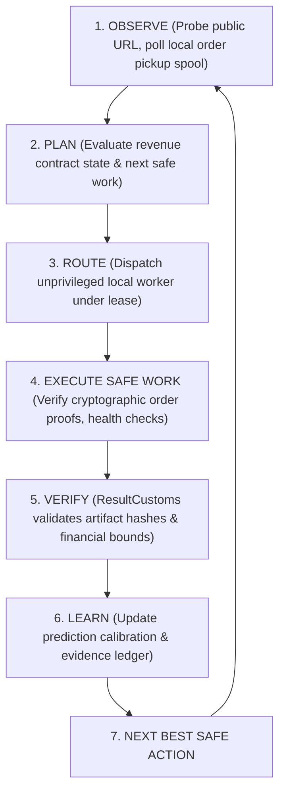

# FUTURE AUTONOMOUS COURIER MISSION: FIRST €5 REVENUE PROOF

## Mission ID
`COURIER_LIVE_FIRST_EUR5_OBSERVATION_AND_REVENUE_PROOF_V1`

## Date Context
Post-Symphony Convergence (when Windows and Mac converge into canonical Courier)

---

## 1. High-Level Mission Goal

**GOAL**: Obtain the first independently verified legitimate **€5.00** revenue evidence from the approved product (`agent-context-trimmer`) while strictly respecting all safety and Human Gates.

---

## 2. Autonomous Operational Loop
Once the human operator opens the gate by publishing the listing and placing the public link into `LIVE_PRODUCT_URL.txt`, **Courier autonomously drives the operational loop without manual step-by-step human prompting**:

Courier continues this autonomous cycle until reaching one of four definitive terminal conditions:

1. **`FIRST_SETTLED_EUR5`**: At least one legitimate order of >= €5.00 is independently proven, verified by `ResultCustoms`, and settled.
2. **`GENUINE_HUMAN_GATE`**: The runtime requires high-privilege human authority (e.g., bank payout transfer or listing modification).
3. **`ECONOMIC_HYPOTHESIS_FALSIFIED`**: Distribution window expires without engagement, proving a commercial funnel defect with recorded diagnostic telemetry.
4. **`BLOCKED_WITH_EVIDENCE`**: Network, platform, or integrity error halts safe progression fail-closed.

---

## 3. Strict Negative Invariants
Courier executes autonomously within its established safety boundaries:
- **Autonomous Spend Limit**: **€0.00**.
- **External Publication / Payment / Account Actions**: Strictly gated behind human authorization.
- **Credential Access**: Strictly forbidden (zero logins, zero passwords, zero session hijacking).
- **Outbound Messaging**: Strictly forbidden (zero automated social posts, emails, or spam).
