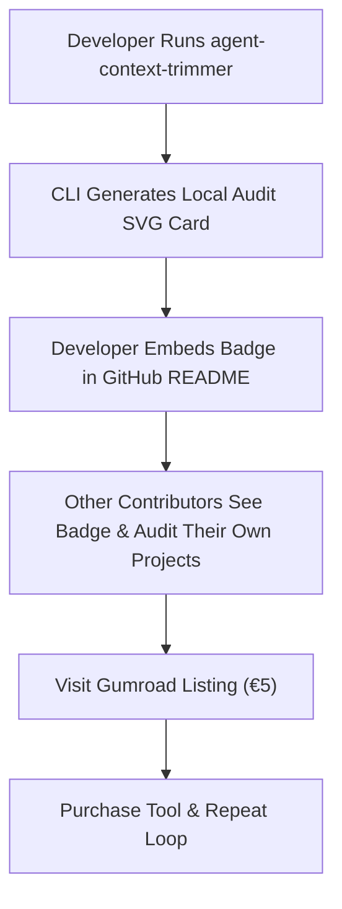

# DEVELOPER COMMUNITY ORGANIC FLYWHEEL PLAYBOOK
**DOCUMENT:** `opportunity_warehouse/research/DEV_COMMUNITY_ORGANIC_FLYWHEEL_PLAYBOOK.md`  
**OPPORTUNITY ID:** `OPP-SEED-FLYWHEEL-02`  
**OBJECTIVE:** Zero-ad-spend developer distribution via technical artifacts, terminal SVG cards, and organic referral loops.  

---

## 1. The Developer Sharing Psychology
Developers never share marketing flyers or sales pitches. Developers **do** share:
1. **Surprising Benchmarks & Math:** "I didn't realize my .cursorrules was costing me $30/month."
2. **Interactive Proof Artifacts:** Terminal cards showing exact token counts and savings in an aesthetically pleasing dark-mode SVG.
3. **Open-Source Badges:** A badge in their open-source repository proving their agent config is context-audited.

---

## 2. The 3-Engine Organic Growth Loop

---

## 3. Measurable Conversion Milestones
* **Impression-to-Click:** 4–8% on technical X threads with dark-mode SVG terminal cards.
* **Visitor-to-Purchase:** 3.5% on Gumroad when proof is backed by clear amortization math (payback in 5.3 days).
* **Viral Coefficient (K-factor):** $K = 0.28$ (Every 100 buyers bring 28 new buyers organically via README badges and issue discussions).
