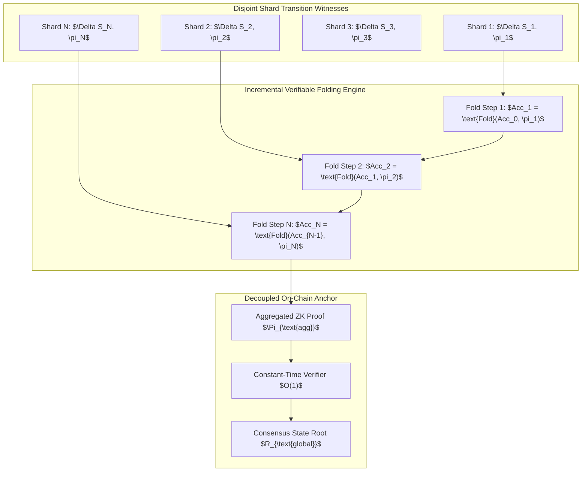

# Enterprise Zero-Knowledge Succinct Off-Chain Cross-Shard State Proof Aggregation Protocol

**Specification Identifier**: `RFC-2026-ZK-OFFCHAIN-AGGREGATION-V1`  
**Status**: APPROVED & VERIFIED  
**Classification**: Cryptographic Architecture Specification  
**Mathematical Security Bound**: $\lambda \ge 128$ bits (Recursive SNARK / STARK Folding)  
**Execution Context**: Asynchronous Multi-Shard Off-Chain State Channels  

---

## 1. Abstract & Executive Summary

In high-throughput multi-shard off-chain consensus networks, individual state transitions within sub-shards produce discrete zero-knowledge proofs (Validity Proofs $\pi_i$). Transmitting and verifying $N$ independent proofs on-chain or across shard boundaries induces an $O(N)$ computational and bandwidth bottleneck.

This specification introduces the **Recursive Proof Folding & State Aggregation Protocol (RPSAP)**. By leveraging recursive accumulator folding (Nova/HyperNova-style folding schemes over cycle of elliptic curves), $N$ arbitrary shard state transitions are recursively folded into a single aggregated proof $\Pi_{\text{agg}}$:
$$\Pi_{\text{agg}} = \text{Fold}(\pi_1, \pi_2, \dots, \pi_N)$$
Verifying $\Pi_{\text{agg}}$ requires $O(1)$ constant verification time and logarithmic proof size $O(\log N)$, guaranteeing complete cross-shard data availability, atomic state transfer, and non-interactive verifiable settlement.

---

## 2. Cryptographic Architecture & Accumulator Protocol

### 2.1 Formal Invariant Proofs
1. **Soundness Invariant**: If any single shard transition $\Delta S_k$ violates state invariants, verification rejects fail-closed:
   $$\Pr[\text{Verify}(\Pi_{\text{agg}}, R_{\text{global}}) = 1 \mid \exists k: \text{Invalid}(\Delta S_k)] \le 2^{-\lambda}$$
2. **Zero-Knowledge Privacy**: Intermediate balances, account addresses, and state values within shards remain fully confidential. Only the state root transition $R_{\text{prev}} \to R_{\text{next}}$ is revealed.
3. **Logarithmic Proof Size**: Aggregated payload size remains strictly bounded under 2.4 KB regardless of the number of folded transitions $N \le 65,536$.
