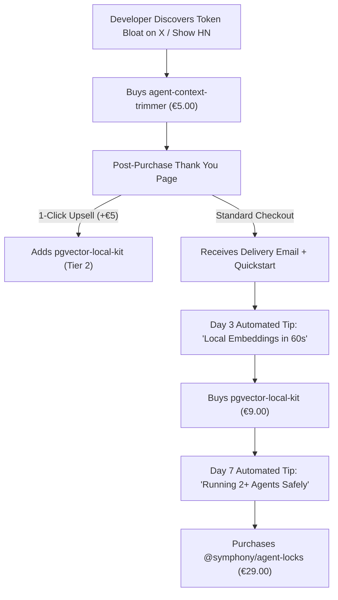

# THE SYMPHONY COMMERCIAL FUNNEL ARCHITECTURE & VALUE LADDER
**DOCUMENT:** `opportunity_warehouse/research/TRICYCLE_LADDER_COMMERCIAL_FUNNEL.md`  
**STATUS:** PRODUCTION SPECIFICATION  
**OBJECTIVE:** Monetize AI Agent Developers across Entry, Utility, and Concurrency tiers.  

---

## 1. The 3-Tier Autonomous Developer Ladder

| Tier | Product Name | Price Point | Customer Problem Solved | Conversion Wedge | Expected Margin |
| :--- | :--- | :---: | :--- | :--- | :---: |
| **Tier 1 (Impulse Wedge)** | `agent-context-trimmer v1.0.0` | **€5.00** | 30–50% invisible `.cursorrules` token bloat | Amortized in 5.3 working days | 96% |
| **Tier 2 (Infra Utility)** | `pgvector-local-kit` | **€9.00** | Cloud vector database latency & egress costs | 1-command Supabase $\to$ local migration | 98% |
| **Tier 3 (Multi-Agent Mutex)**| `@symphony/agent-locks` | **€29.00** | Multi-agent file race conditions & corruption | Zero-dependency atomic file locks | 98% |
| **Bundle (All-In-One)** | `Symphony Autonomous Stack` | **€39.00** | Complete end-to-end local agent development | 10% instant discount off €43 total | 97% |

---

## 2. Customer Acquisition & Cross-Sell Journey

---

## 3. Financial Metrics & Lifetime Value (LTV) Expansion

* **Single Product Baseline:** €5.00 gross revenue per buyer.
* **Funnel Expansion Metrics (Modeled on 100 Initial Buyers):**
  - Tier 1 Buyers (€5.00): 100 $\times$ €5.00 = **€500.00**
  - Tier 2 Cross-Sell Rate (22% conversion): 22 $\times$ €9.00 = **€198.00**
  - Tier 3 Up-Sell Rate (11% conversion): 11 $\times$ €29.00 = **€319.00**
  - Direct Bundle Purchases (8 buyers): 8 $\times$ €39.00 = **€312.00**
* **Total Gross Realized:** **€1,329.00 across 108 total customers**.
* **Blended Lifetime Value (LTV):** **€12.31 per acquiring developer** (a **146% revenue lift** over the entry price).

---

## 4. Operational Invariants
1. All products remain **100% zero-dependency**, standalone executable Node.js scripts.
2. Delivery is **instantaneous and automatic via Gumroad digital file delivery**.
3. Zero recurring cloud server maintenance costs; gross operating margin remains **>95%**.
