# Courier Symphony — Muse Wall-Ready Task Ledger Specification — 2026-09-27

Status: CANONICAL OPERATIONAL TASK LEDGER SPECIFICATION  
Authority: Muse Slot Worker Execution & Supervisor Contract  
Target Consumer: Muse Wall Workers & Mac Supervisor (`scripts/mac_worker/muse_supervisor.py`)  
Effective Date: 2026-09-28 (Tomorrow's Scheduled Wall Execution)

---

## 1. Executive Summary & Purpose

This document defines the exact, machine-readable Task Record schema, lifecycle protocol, and concrete task payloads that Muse Wall workers will consume. 

In Courier Symphony, Muse operates as a bounded execution worker within an isolated slot topology under `scripts/mac_worker/muse_supervisor.py`. The supervisor ensures zero-human relay, device-adaptive admission (`MAX_HEAVY_JOBS=1`), and crash-resilient persistence across host restarts.

---

## 2. Muse Slot Architecture & Runtime Environment

### 2.1. Slot Directory Layout
Each active Muse worker is strictly isolated to its assigned slot directory:
```text
<COURIER_WALL_DIR>/
├── STOP                         # Global wall stop trigger (file presence halts all slots)
├── supervisor.lock              # Exclusive file lock for the single supervisor process
├── config.json                  # Wall configuration (server URL, base capabilities)
├── slots.json                   # Current slot registry and PID bindings
└── slots/
    ├── 01/
    │   ├── state/
    │   │   ├── current_task.json        # Atomic task state (CLAIMED -> STARTED -> RESULT_READY)
    │   │   ├── muse_process.json       # Child process PGID and liveness tracker
    │   │   └── checkpoint.json         # Bound session checkpoint for resumption
    │   └── logs/
    │       ├── worker.log              # Daemon stdout/stderr audit trail
    │       └── muse_exec.log           # Raw Muse process output
    └── 02/
        └── ...
```

### 2.2. Process Invocation & Protocol
- **Supervisor Role:** Manages slot lifecycle, enforces backoff, monitors capacity via `CapacityGovernor`, and starts slots:
  ```bash
  python3 scripts/mac_worker/muse_supervisor.py start <TARGET_SLOTS> [--no-loop]
  ```
- **Daemon Role:** `scripts/mac_worker/daemon.py` polls `POST /tasks/claim`, acquires lease, executes Muse, and delivers results via `POST /tasks/result`.
- **Muse CLI Protocol:** Operates strictly under `headless-v1` protocol:
  ```bash
  muse exec --workspace <WORKSPACE> [--reasoning-effort <LEVEL>] [--yolo] "<PROMPT>"
  ```
- **Resume Protocol:** If resuming an existing session, uses verified envelope:
  ```bash
  muse resume --workspace <WORKSPACE> <SESSION_REF>
  ```

---

## 3. Canonical Wall-Ready Task Record Schema

When the Courier server dispatches a task to a Muse Wall slot (via `POST /tasks/claim`), or when pre-seeding ready tasks for offline wall runs, the task record must conform to the following schema:

```json
{
  "$schema": "https://json-schema.org/draft/2020-12/schema",
  "title": "MuseWallReadyTaskRecord",
  "type": "object",
  "required": [
    "goal_id",
    "task_id",
    "attempt_id",
    "dispatch_id",
    "worker_id",
    "slot_id",
    "mode",
    "muse_action",
    "instruction",
    "workspace",
    "target_capability",
    "workload_class",
    "artifacts",
    "status",
    "attempts",
    "dependencies",
    "do_not_repeat_fingerprint"
  ],
  "properties": {
    "goal_id": {
      "type": "string",
      "description": "Parent goal identifier (e.g. 'goal-canary-20260928')"
    },
    "task_id": {
      "type": "string",
      "description": "Unique task identifier (e.g. 'MUSE-001')"
    },
    "attempt_id": {
      "type": "string",
      "pattern": "^.+:attempt:[0-9]+$",
      "description": "Monotonic attempt binding (e.g. 'MUSE-001:attempt:1')"
    },
    "dispatch_id": {
      "type": "string",
      "pattern": "^dispatch-[a-f0-9]{32}$",
      "description": "Single-flight token minted for this claim"
    },
    "worker_id": {
      "type": "string",
      "description": "Assigned worker ID (e.g. 'MAC-MUSE-SLOT-01')"
    },
    "slot_id": {
      "type": "string",
      "description": "Assigned two-digit slot ID (e.g. '01')"
    },
    "mode": {
      "type": "string",
      "const": "MUSE"
    },
    "muse_action": {
      "type": "string",
      "enum": ["exec", "resume", "session-message"]
    },
    "instruction": {
      "type": "string",
      "description": "Complete, unambiguous prompt instruction delivered to Muse"
    },
    "workspace": {
      "type": "string",
      "description": "Absolute canonical workspace directory path"
    },
    "target_capability": {
      "type": "string",
      "enum": ["macos", "mac"]
    },
    "workload_class": {
      "type": "string",
      "enum": ["LIGHT_READ_ONLY", "TARGETED_TEST", "HEAVY_JOB", "PHYSICAL_RUNTIME"],
      "description": "Workload classification for device-adaptive admission"
    },
    "artifacts": {
      "type": "array",
      "items": { "type": "string" },
      "description": "Expected relative artifact filenames (e.g. ['report.json'])"
    },
    "expected_artifacts": {
      "type": "object",
      "additionalProperties": { "type": "string" },
      "description": "Task-owned expected SHA-256 hashes"
    },
    "status": {
      "type": "string",
      "enum": ["QUEUED", "DISPATCHED", "RESULT_RECEIVED", "RECONCILED"]
    },
    "attempts": {
      "type": "integer",
      "minimum": 1
    },
    "dependencies": {
      "type": "array",
      "items": { "type": "string" }
    },
    "do_not_repeat_fingerprint": {
      "type": "string",
      "description": "SHA-256 fingerprint guaranteeing this task hasn't completed"
    },
    "session_ref": {
      "type": ["string", "null"],
      "description": "Session token if resuming an existing session"
    },
    "admission_envelope": {
      "type": "object",
      "properties": {
        "admitted_motors": { "type": "integer" },
        "active_motors": { "type": "integer" },
        "heavy_jobs": { "type": "integer", "maximum": 1 }
      }
    }
  }
}
```

---

## 4. Slot Execution Lifecycle (`current_task.json`)

To survive sudden crashes, memory kills, or power interruptions without repeating irreversible side-effects, the local daemon transitions `state/current_task.json` through four explicit phases:

```mermaid
stateDiagram-v2
    [*] --> CLAIMED: Claimed from server / Written to slot
    CLAIMED --> STARTED: Muse process forked (PGID recorded)
    STARTED --> RESULT_READY: Muse finished; result payload finalized
    RESULT_READY --> COMPLETED: POST /tasks/result acknowledged (200 OK)
    RESULT_READY --> RELEASE_PENDING: Server returned 4xx (unrecoverable)
    RELEASE_PENDING --> [*]: Slot releases task to server
    COMPLETED --> [*]: Slot exits 0 (COURIER_WORKER_ONE_TASK=1)
```



### Phase Invariants
1. **`CLAIMED`:** The task has been accepted by the slot, but the child process has NOT yet spawned. If the daemon restarts while in `CLAIMED`, it is safe to either launch the task or return it to the queue.
2. **`STARTED`:** The child process has been spawned. The daemon writes `worker_phase="STARTED"` to disk atomically *before* executing the binary. **A daemon restart NEVER re-launches a task in `STARTED` phase.** It waits for the existing child process or reconciles the crash state.
3. **`RESULT_READY`:** Muse execution terminated and produced a local outcome. The result payload is permanently bound in `current_task.json`. On restart, the daemon **only re-delivers the stored result**; it never re-executes the work.
4. **`RELEASE_PENDING`:** If the server returns a 4xx error (e.g. attempt superseded or lease expired), the result is dead. The slot resets its state and releases the assignment.

---

## 5. DurableResult Output Contract

When Muse finishes execution, the slot daemon packages the outcome into a canonical `DurableResult` conforming to `scripts/integration_contract.py`:

```json
{
  "goal_id": "goal-canary-20260928",
  "task_id": "MUSE-001",
  "attempt_id": "MUSE-001:attempt:1",
  "dispatch_id": "dispatch-c4b3a2019876543210abcdef01234567",
  "worker_id": "MAC-MUSE-SLOT-01",
  "run_id": "run-slot01-1758999900",
  "result_id": "result-7f83b1657ff1fc53b92dc18148a1d65dfc2d4b1fa3d677284addd200126d9069",
  "status": "SUCCESS",
  "artifacts": [
    {
      "path": "canary_output.json",
      "sha256": "4b227777d4dd1fc61c6f884f48641d02b4d121d3fd328cb08b5531fcacdabf8a",
      "artifact_id": "art-4b227777d4dd1fc61c6f884f48641d02b4d121d3fd328cb08b5531fcacdabf8a",
      "size": 182
    }
  ],
  "result_data": {
    "execution_mode": "MUSE",
    "exit_code": 0,
    "slot_id": "01",
    "completed_at": 1758999945.0,
    "diagnostic": "Execution complete; 1 artifact verified"
  }
}
```

### Content Authority Rule
- `artifacts` contains the files produced by the worker and uploaded to the server store.
- The worker **MUST NOT** include `expected_sha256` inside `artifacts`. Exact-content authority resides solely in `task["expected_artifacts"]`.

---

## 6. Concrete Pre-Seeded Task Records for Tomorrow (2026-09-28)

These five concrete tasks form the initial execution queue for the Muse Wall. They adhere to the single-writer rule, focus on customer-visible evidence, and respect `MAX_HEAVY_JOBS=1`.

### Task 1: `MUSE-WALL-001` — Host & Runtime Pre-Flight Verification
```json
{
  "goal_id": "goal-wall-20260928",
  "task_id": "MUSE-WALL-001",
  "attempt_id": "MUSE-WALL-001:attempt:1",
  "dispatch_id": "dispatch-00100100100100100100100100100101",
  "worker_id": "MAC-MUSE-SLOT-01",
  "slot_id": "01",
  "mode": "MUSE",
  "muse_action": "exec",
  "instruction": "Verify host environment: assert Darwin OS, check that port 8081 is free for staging, verify python3 >= 3.9 is available, and generate a preflight audit report in host_preflight.json.",
  "workspace": "/Users/user/Downloads/2026-courier",
  "target_capability": "macos",
  "workload_class": "LIGHT_READ_ONLY",
  "artifacts": ["host_preflight.json"],
  "expected_artifacts": {},
  "status": "QUEUED",
  "attempts": 1,
  "dependencies": [],
  "do_not_repeat_fingerprint": "dnr-muse-preflight-001",
  "session_ref": null,
  "admission_envelope": {
    "admitted_motors": 4,
    "active_motors": 1,
    "heavy_jobs": 0
  }
}
```

### Task 2: `MUSE-WALL-002` — Central Writer Candidate Diff Verification
```json
{
  "goal_id": "goal-wall-20260928",
  "task_id": "MUSE-WALL-002",
  "attempt_id": "MUSE-WALL-002:attempt:1",
  "dispatch_id": "dispatch-00200200200200200200200200200202",
  "worker_id": "MAC-MUSE-SLOT-02",
  "slot_id": "02",
  "mode": "MUSE",
  "muse_action": "exec",
  "instruction": "Inspect git log on origin/coordination/autofill-task-seed-20260926. Check for candidate-b-3 commit. Verify whether git diff --check passes with 0 whitespace errors across scripts/courier_verifier.py, scripts/integration_contract.py, tests/test_artifact_upload_flow.py, server/app.py, and tests/test_p3_server_idempotency.py. Write candidate_diff_report.json.",
  "workspace": "/Users/user/Downloads/2026-courier",
  "target_capability": "macos",
  "workload_class": "LIGHT_READ_ONLY",
  "artifacts": ["candidate_diff_report.json"],
  "expected_artifacts": {},
  "status": "QUEUED",
  "attempts": 1,
  "dependencies": ["MUSE-WALL-001"],
  "do_not_repeat_fingerprint": "dnr-muse-diff-check-002",
  "session_ref": null,
  "admission_envelope": {
    "admitted_motors": 4,
    "active_motors": 1,
    "heavy_jobs": 0
  }
}
```

### Task 3: `MUSE-WALL-003` — Staging Server Deployment on Port 8081
```json
{
  "goal_id": "goal-wall-20260928",
  "task_id": "MUSE-WALL-003",
  "attempt_id": "MUSE-WALL-003:attempt:1",
  "dispatch_id": "dispatch-00300300300300300300300300300303",
  "worker_id": "MAC-MUSE-SLOT-01",
  "slot_id": "01",
  "mode": "MUSE",
  "muse_action": "exec",
  "instruction": "Initialize staging server instance on PORT=8081 with isolated database at courier_work/canary_run1/state/central_state.json. Assert GET http://127.0.0.1:8081/ returns 200 OK. Generate staging_server_receipt.json.",
  "workspace": "/Users/user/Downloads/2026-courier",
  "target_capability": "macos",
  "workload_class": "TARGETED_TEST",
  "artifacts": ["staging_server_receipt.json"],
  "expected_artifacts": {},
  "status": "QUEUED",
  "attempts": 1,
  "dependencies": ["MUSE-WALL-002"],
  "do_not_repeat_fingerprint": "dnr-muse-staging-server-003",
  "session_ref": null,
  "admission_envelope": {
    "admitted_motors": 4,
    "active_motors": 1,
    "heavy_jobs": 0
  }
}
```

### Task 4: `MUSE-WALL-004` — Physical Canary Execution RUN_1
```json
{
  "goal_id": "goal-wall-20260928",
  "task_id": "MUSE-WALL-004",
  "attempt_id": "MUSE-WALL-004:attempt:1",
  "dispatch_id": "dispatch-00400400400400400400400400400404",
  "worker_id": "MAC-MUSE-SLOT-01",
  "slot_id": "01",
  "mode": "MUSE",
  "muse_action": "exec",
  "instruction": "Execute RUN_1 physical canary pass: dispatch two-step workflow (Task A -> Independent Verifier -> Auto Task B) against PORT=8081. Verify Task A succeeds with zero human relay, verifier confirms SHA-256 match, and Task B automatically claims. Write run1_physical_proof.json.",
  "workspace": "/Users/user/Downloads/2026-courier",
  "target_capability": "macos",
  "workload_class": "PHYSICAL_RUNTIME",
  "artifacts": ["run1_physical_proof.json"],
  "expected_artifacts": {},
  "status": "QUEUED",
  "attempts": 1,
  "dependencies": ["MUSE-WALL-003"],
  "do_not_repeat_fingerprint": "dnr-muse-run1-proof-004",
  "session_ref": null,
  "admission_envelope": {
    "admitted_motors": 4,
    "active_motors": 1,
    "heavy_jobs": 1
  }
}
```

### Task 5: `MUSE-WALL-005` — Restart Persistence & Replay Gate RUN_2
```json
{
  "goal_id": "goal-wall-20260928",
  "task_id": "MUSE-WALL-005",
  "attempt_id": "MUSE-WALL-005:attempt:1",
  "dispatch_id": "dispatch-00500500500500500500500500500505",
  "worker_id": "MAC-MUSE-SLOT-01",
  "slot_id": "01",
  "mode": "MUSE",
  "muse_action": "exec",
  "instruction": "Execute RUN_2 restart survival pass: cleanly send SIGTERM to staging server, restart server on PORT=8081, re-query Task A state, and prove Task A is not re-executed (attempts remains 1, duplicate submission returns ACK_DUPLICATE). Write run2_restart_proof.json.",
  "workspace": "/Users/user/Downloads/2026-courier",
  "target_capability": "macos",
  "workload_class": "TARGETED_TEST",
  "artifacts": ["run2_restart_proof.json"],
  "expected_artifacts": {},
  "status": "QUEUED",
  "attempts": 1,
  "dependencies": ["MUSE-WALL-004"],
  "do_not_repeat_fingerprint": "dnr-muse-run2-proof-005",
  "session_ref": null,
  "admission_envelope": {
    "admitted_motors": 4,
    "active_motors": 1,
    "heavy_jobs": 0
  }
}
```

---

## 7. Device Admission & Resource Guards for Muse Wall

1. **`MAX_HEAVY_JOBS = 1`:** Only one `PHYSICAL_RUNTIME` or `HEAVY_JOB` task may execute across all slots simultaneously. If Slot 01 is running `MUSE-WALL-004`, Slot 02 must wait or process a `LIGHT_READ_ONLY` task.
2. **`CapacityGovernor` Evaluation:** Before launching Muse, the daemon calls `CapacityGovernor(1).evaluate()`. If load or memory pressure exceeds threshold, it raises `MuseAdmissionBlocked` and leaves the task in `CLAIMED` status without spawning the process.
3. **Clean Shutdown (`STOP` file):** Touching `<COURIER_WALL_DIR>/STOP` signals all slots to finish current step, write checkpoint, and exit cleanly without leaving orphaned child processes.
