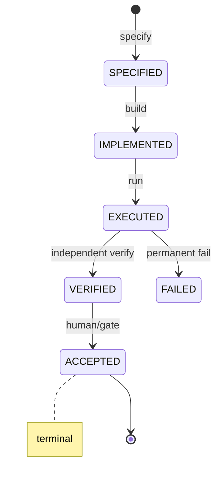
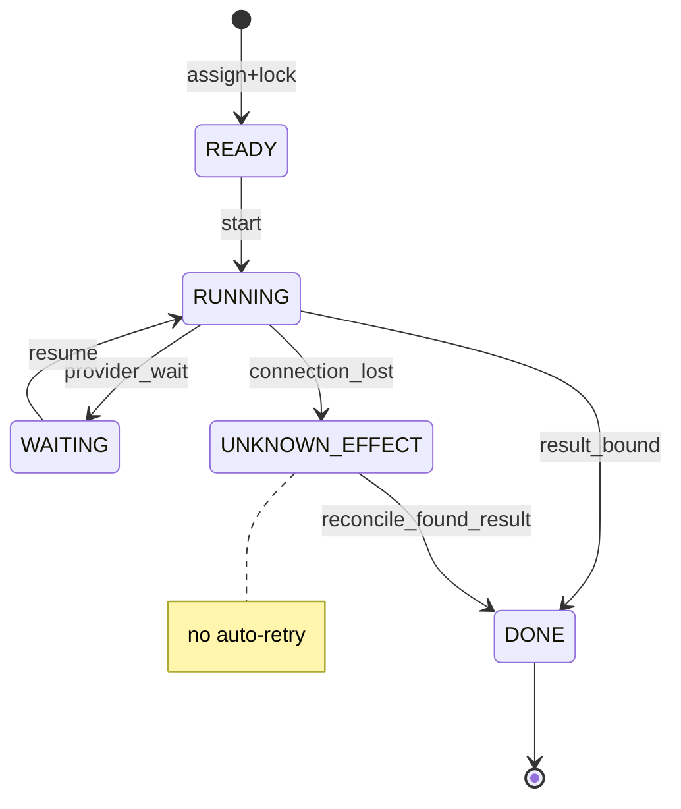

# Courier UX Specs — Core states, badges, errors, workers (MUSE 51,53,54,55,56,57,58,59,62,66,67,68,69,72 + 36-copy)

## 51 — Status truth table (canonical)
| Status | Zwingende Evidence | Beweist NICHT | Erlaubte nächste Zustände | Darf setzen | UI-Text |
|---|---|---|---|---|---|
| SPECIFIED | spec text + scope hash stored | anything implemented | IMPLEMENTED | planner/human | "Spezifiziert" |
| IMPLEMENTED | code/candidate ref + build | execution, correctness | EXECUTED | builder | "Implementiert (nicht ausgeführt)" |
| EXECUTED | execution_id + result artifact or failure | correctness, acceptance | VERIFIED (via verifier), FAILED | worker/runtime | "Ausgeführt" |
| VERIFIED | verifier_id + policy + decision + timestamp | acceptance, production safety | ACCEPTED, REJECTED | verifier only | "Verifiziert · <verifier_id>" |
| ACCEPTED | human or gate receipt id | production deployment | terminal | human/gate | "Abgenommen" |
| OPEN_AVAILABLE | worker registered, no connection proof | reachability | CONNECTED | registry | "Registriert (nicht verbunden)" |
| CONNECTED | successful handshake timestamp | availability for work | AVAILABLE | runtime | "Verbunden" |
| AVAILABLE | heartbeat within freshness window | running work, capability match | READY, CONNECTED (on expiry) | runtime | "Bereit" |
| READY | task assigned + scope lock acquired | execution started | RUNNING, WAITING | scheduler | "Startbereit" |
| RUNNING | execution_id + start event | progress, completion | WAITING, BLOCKED, DONE | worker | "Läuft · <execution_id>" |
| WAITING | reason code + what is awaited | deadlock-free, ETA | READY, BLOCKED | scheduler | "Wartet: <reason>" |
| BLOCKED | blocker + owner + since | resolution | WAITING, FAILED | runtime/human | "Blockiert: <blocker>" |
| DONE | result bound to task | verification, acceptance | VERIFIED-path or terminal | runtime | "Fertig (nicht verifiziert)" |

## 53 — Build badge
Fields: SOURCE_SHA · TREE_SHA · BUILD_FINGERPRINT · LOADED_RUNTIME_IDENTITY · DIRTY/CLEAN · MATCH/MISMATCH.
Green only if LOADED_RUNTIME_IDENTITY == expected candidate (SHA+tree+fingerprint all match).
HEAD alone never suffices (HEAD is a branch pointer, not a build).
Mismatch text: "Geladene Runtime ≠ erwarteter Candidate — keine Freigabe."

## 54 — Task history timeline
Task <id> → Attempt <n, id, worker, started_at, retry_reason> → Execution <execution_id, lane>
→ Result <result_id, provenance, stored_at> → Verification <verifier_id, decision, at>
→ Acceptance <receipt_id, by, at>. Stale attempts stay listed with badge "STALE — superseded by attempt N".

## 55 — Retry explainability (copy DE/EN short)
- SAFE_RETRY — Warum: kein externer Effekt bestätigt. Passiert: neuer Attempt, gleiche Scope. Nicht: doppelter Effekt. Nächste Aktion: "Erneut versuchen".
- RECONCILE_FIRST — Warum: unklarer Vorzustand. Passiert: nichts, bis Reconciliation. Nicht: auto-retry. Aktion: "Reconciliation öffnen".
- PERMANENT_FAIL — Warum: Provider/Policy lehnt Input ab. Passiert: terminal, kein Retry. Nicht: weitere Versuche. Aktion: "Task überarbeiten".
- HUMAN_GATE — Warum: Freigabe nötig. Passiert: Warten auf Freigabe. Nicht: automatischer Start. Aktion: "Zur Freigabe".
- CIRCUIT_OPEN — Warum: Provider überlastet/fehlerhaft. Passiert: Warten bis Probe-Zeitpunkt. Nicht: neue Calls. Aktion: "Abwarten / Provider wechseln".
- STALE_EXECUTION — Warum: Attempt veraltet. Passiert: ignoriert. Nicht: angerechnet. Aktion: "Aktuellen Attempt ansehen".
- UNKNOWN_EFFECT — Warum: Wirkung unbestätigt. Passiert: kein Retry. Nicht: zweiter Versuch. Aktion: "Reconciliation".
Never a bare "Retrying...".

## 56 — Circuit breaker UI
States CLOSED (calls flow) / OPEN (new work blocked, reason + last error + next probe time shown) / HALF_OPEN (one controlled probe).
After OPEN at most one probe per policy window; probe result decides close/re-open.

## 57 — Provider health card
Provider · Connection (CONNECTED only with handshake evidence; OPEN_AVAILABLE never shown as connected)
· Availability · Capabilities · Last success · Last failure · 429 pressure · Circuit state
· Current load · Evidence freshness (timestamp + FRESH/AGING/STALE/UNKNOWN).

## 58 — Worker identity card
worker_id · session_id · runtime identity · build identity · capabilities · current execution
· last result · connection state · availability · last heartbeat/evidence.
Never derive identity from display name.

## 59 — Evidence freshness
FRESH: within window. AGING: usable, re-check soon. STALE: must not gate decisions, re-verify.
UNKNOWN: no timestamp — treat as STALE. Windows are policy values set by Google, not invented here:
each area (runtime identity, provider health, task state, result verification, build evidence) shows
which timestamp counts and from when the UI marks it invalid. No invented thresholds in this spec.

## 62 — State machine visualizer (Mermaid)

Task/Worker/Provider/Human-Gate/Night-Run diagrams follow the same pattern; human-only
transitions (ACCEPTED, gate approve, emergency stop) are marked `<<human>>`, illegal
transitions (DONE without result, ACCEPTED before VERIFIED) are absent by construction.

## 66 — Stop after current (dialog)
Shows: running executions (may finish) · what may be ended · tasks staying queued
· new starts prevented: YES · CLEAN_IDLE when RUNNING=0 and no unknown effects.

## 67 — Emergency stop
Warns: stopping processes does NOT roll back external effects. Shows running executions,
unknown effects, reconciliation needed, queued work. No generic kill buttons.

## 68 — Orphan worker diagnostic (read-only definition)
Orphan if: worker process alive (PID/PPID/start time match) but session_id unknown to
runtime, or heartbeat stale while execution not terminal, or runtime identity mismatch.
Detect via PID+PPID+worker_id+session_id+execution_id+start time+runtime identity.
Diagnose only — never kill.

## 69 — Stale lease
See fixtures_safety.json STALE_LEASE_UX. Lease expiry ≠ old worker stopped. UI: RECONCILE REQUIRED.

## 72 — Read/write scope matrix
| Task type | READ | WRITE | External effects | Human gate? | Parallel safe? |
|---|---|---|---|---|---|
| code change in repo | repo/dir/file | repo/dir/file | none until merge/deploy | merge: yes | only disjoint scopes |
| provider call | config, task | result store | yes (provider-side) | budget-gated | per circuit limit |
| artifact publish | artifact meta | artifact store | yes if public | PUBLICATION | no (fencing token) |
| delete/cleanup | test ws | test ws only | no (test scope) | DELETE outside test scope | yes within test ws |
| account/billing action | account meta | none directly | yes | PAYMENT/AUTH | never parallel |
Scopes: repo · directory · file · account · provider · artifact · remote API.

## 36-copy — Error UX texts (DE, exact)
BUSY_WAIT→"Warte auf freie Kapazität …"; NETWORK_CALL→"Netzwerkzugriff läuft …";
CPU_RISK→"Rechenintensiver Schritt …"; RECOMMENDED_EVENT_SOURCE→"Empfohlene Quelle";
SOURCE_SHA/TREE_SHA/BUILD_FINGERPRINT→as labeled hex; LOADED_APP_IDENTITY→"Geladene App";
BUILD_TIMESTAMP→"Build-Zeit"; DIRTY_AT_BUILD→"Build war dirty — kein Release";
SLOW_SUCCESS→"Langsam, aber erfolgreich"; TIMEOUT_BEFORE_EFFECT→"Timeout vor Wirkung — unklar, nichts erneut starten";
UNKNOWN_AFTER_EFFECT→"Wirkung unbekannt — Reconciliation nötig"; STALE_RESULT→"Veraltetes Ergebnis";
LARGE_RESULT→"Großes Ergebnis — Vorschau"; MALFORMED_RESULT→"Unlesbares Ergebnis";
DESKTOP_WRITABLE→"Schreibzugriff ok"; DESKTOP_BLOCKED→"Schreibzugriff blockiert";
NOT_FOUND→"Nicht gefunden"; TECH_CODE/USER_TITLE/ONE_LINE per catalog;
MOCK_SHA→"Mock-Kennung (kein Echtheitsnachweis)".
