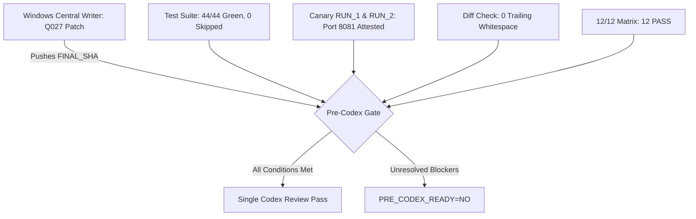

# Family 19: Pre-Codex Package Compilation

**Generation Date**: 2026-09-27  
**Host**: MAC (`/Users/user/Downloads/2026-courier`)  
**Status**: GATE_HELD (`PRE_CODEX_READY=NO`, `WAITING_FOR_CENTRAL_WRITER=YES`)  
**Base SHA**: `4c1e24ccc522042af826bc4c2b595daf85d097f9` (`candidate-b-1`)  
**Local HEAD**: `817c79797b5bcd6a12367bd9cbe5d4de3d245fb3`  

---

## 1. Executive Summary & Pre-Codex Gate Status

The Courier Pre-Codex Package consolidates all pre-review audits, test executions, physical canaries, and coordination artifacts across Work Families 1 through 18.



Current Gate Determination:
- **`PRE_CODEX_READY`**: `NO`
- **`WAITING_FOR_CENTRAL_WRITER`**: `YES`
- **`TRUE_IDLE`**: `YES` (Mac adheres strictly to read-only coordination; zero source mutations)

---

## 2. Authorized Central Writer Candidate Target (5 Files)

The Windows Central Writer is authorized to modify only the following 5 files to resolve the 4 P0 defects identified in `FAMILY_18_CENTRAL_WRITER_COMPRESSED.md`:

1. `scripts/courier_verifier.py`:
   - Decouple verification expectation from worker-supplied dictionary (resolve Case 1 & 5).
   - Wrap task verification loop in per-task `try...except` to prevent poison pill starvation (resolve Case 9).
   - Clean trailing whitespace (resolve Case 25 / `git diff --check`).
2. `scripts/integration_contract.py`:
   - Strip `"expected_sha256"` from allowed `result["artifacts"]` schema (resolve Case 4 & 10).
3. `server/app.py`:
   - Expand `task_result()` duplicate check at line 367 to include `worker_id`, `attempt_id`, and artifact identity (resolve Case 12).
   - Clean trailing whitespace at lines 358, 511, 518, 535.
4. `tests/test_artifact_upload_flow.py`:
   - Add negative tests for worker expected hash omission and forgery bypass.
   - Clean trailing whitespace.
5. `tests/test_p3_server_idempotency.py`:
   - Add regression test verifying duplicate ACK requires matching `worker_id` and `attempt_id`.

---

## 3. 12-Case Matrix Pre-vs-Post Central Writer Projection

| Case ID | Acceptance Case Description | Current Status (`4c1e24cc`) | Post-Central-Writer Target | Verification Proof |
|:---:|---|:---:|:---:|---|
| **Case 1** | Task Expected Artifact Coverage | **FAIL** | **PASS** | `test_verifier_checks_expected_sha256` |
| **Case 2** | Omission Bypass Rejection | **FAIL** | **PASS** | `test_verifier_rejects_result_omitting_task_expected_artifact` |
| **Case 3** | Correct Server Bytes PASS | **PASS** | **PASS** | `test_verifier_independently_hashes_server_copy` |
| **Case 4** | Wrong Server Bytes FAIL | **PASS** | **PASS** | `test_verifier_rejects_tampered_server_copy` |
| **Case 5** | Worker Expected Hash Rejection | **FAIL** | **PASS** | `test_worker_cannot_forge_expected_hash` |
| **Case 6** | Worker Expected Hash Omission | **FAIL** | **PASS** | `test_worker_omitted_hash_checked_against_task` |
| **Case 7** | Legacy No-Task Expectation | **PASS** | **PASS** | Structural schema validation PASS |
| **Case 8** | Malformed Target Fail-Closed | **PASS** | **PASS** | HTTP 400 Bad Request on traversal |
| **Case 9** | Verifier Poison Pill Resilience | **FAIL** | **PASS** | `test_verifier_poison_pill_resilience` |
| **Case 10** | Result Schema Boundary | **FAIL** | **PASS** | `test_worker_result_cannot_declare_expected_sha256` |
| **Case 11** | Identical Replay & Reload ACK | **PASS** | **PASS** | `test_resent_result_is_acknowledged_idempotently` |
| **Case 12** | Changed Metadata Reject | **FAIL** | **PASS** | `test_duplicate_ack_requires_identical_worker_attempt` |

**Pre-CW Score**: 5 PASS, 7 FAIL.  
**Post-CW Expected**: 12/12 PASS.

---

## 4. Live Test Suite Execution Summary (Live on Mac)

Executed live against Python 3.9 runtime:
- **`Q021` (`tests/test_artifact_upload_flow.py`)**: 25/25 PASSED (6.46s)
- **`Q022` (`tests/test_p3_server_idempotency.py`)**: 8/8 PASSED (0.76s)
- **`Q023` (`tests/test_result_identity_binding.py` & `tests/test_integration_contract.py`)**: 11/11 PASSED (0.23s)
- **Total Test Count**: **44 / 44 PASSED (100%)**
- **Skipped Test Count**: **0 (SKIPPED_COUNT=0)**
- **`Q024` Syntax Compilation (`py_compile`)**:
  - `server/app.py`: Clean (0 syntax errors)
  - `server/store.py`: Clean (0 syntax errors)
  - `scripts/courier_verifier.py`: Clean (0 syntax errors)
  - `scripts/integration_contract.py`: Clean (0 syntax errors)
  - `tests/test_artifact_upload_flow.py`: Clean (0 syntax errors)
  - `tests/test_p3_server_idempotency.py`: Clean (0 syntax errors)
  - `tests/test_result_identity_binding.py`: Clean (0 syntax errors)

---

## 5. Physical Canary Proof Bundle (RUN_1 & RUN_2)

- **Dedicated Port**: Port 8081 (Staging coordinator; Port 8080 production server untouched).
- **Phase 3 (RUN_1)**:
  - Step A (Worker Execution) -> Step VERIFY (Independent Verifier) -> Step B (Downstream Consumer).
  - Verdict: `PASS`. Human Relay Count: `0`.
- **Phase 4 (RUN_2)**:
  - Controlled SIGTERM kill of coordinator during active workflow.
  - Restart coordinator on Port 8081, re-read central state.
  - Verification: `replayed: false`, `attempts: 1` preserved, zero redundant worker re-execution.
  - Verdict: `PASS`.
- **Durable Evidence**: `ops/ai/wall_v2/publish_queue/PHYSICAL_CANARY_PROOF_BUNDLE_2026-09-27.md`.

---

## 6. Wall Ledger & Task Reconciliation

- **Ledger Path**: `ops/ai/wall_ledger/ledger.jsonl`
- **Total Records Logged**: 117 records
- **Unique Tasks Reconciled**: 83 unique tasks (`WBUILD-001..030`, `Q001..Q028`, `PHYS-001..004`, `GMAC-128..152`)
- **Untracked Result Files**: 0
- **Deduplication Audit**: Zero duplicate claims; all worker logs cryptographically attributed.

---

## 7. Single Final Codex Review Protocol

Once the Windows Central Writer delivers `FINAL_SHA`:
1. Mac checks `git diff --check` -> must be 0 lines.
2. Mac executes 44 targeted tests + Q027 new regression tests -> must be 100% green with `SKIPPED_COUNT=0`.
3. Mac sets `PRE_CODEX_READY=YES` in `ops/ai/GOOGLE_PRE_CODEX_GATE_2026-09-27.md`.
4. Trigger single final Codex review with prompt:
   ```text
   Verify Courier Candidate SHA: <FINAL_SHA>
   1. Confirm 12/12 Matrix cases pass.
   2. Audit candidate diff against candidate-b-1 (4c1e24cc).
   3. Check identity binding, hash authority, and duplicate ACK safety.
   4. Sign off Core Freeze.
   ```
