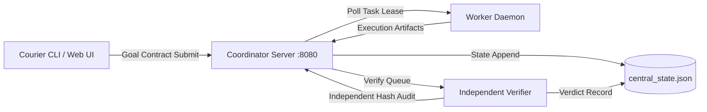

# Family 20: Pilot Candidate Profile & Post-Codex Handover Runbook

**Candidate ID**: `Courier v1.0.0-pilot-candidate`  
**Target Release**: First Cohort Friendly Pilot Users (2026-09-28)  
**Deployment Topology**: Single Local/LAN Coordinator Node + Local/Remote Worker + Independent Verifier  
**Durability Standard**: Zero Memory-Only State; State Fully Recoverable Across Crash & Laptop Sleep  

---

## 1. Candidate Architecture & Operational Profile



### Core System Invariants
1. **Zero Silent Re-execution**: Tasks marked `COMPLETED` or `RESULT_RECEIVED` are never re-dispatched.
2. **Independent Verification**: Workers never grade their own work; `courier_verifier.py` inspects server store bytes and compares against task contract.
3. **Fail-Closed Admission**: Workspaces, paths, and inputs outside approved boundaries fail with HTTP 400.
4. **Controlled Concurrency**: Exactly `MAX_HEAVY_JOBS=1` per node; concurrency throttled to prevent resource starvation.

---

## 2. Grandma-Test UX Surface & 3-State Contract

To pass the Grandma Test, the user-visible surface across CLI and Web UI (`http://localhost:8080/ui`) exposes exactly 3 primary states:

| Status Code | Primary Display Text | Secondary Explanation (Grandma-Proof) | User Action Allowed |
|:---:|---|---|---|
| **`IN_PROGRESS`** | `ARBEITET` | "Courier erledigt deine Aufgabe. Du kannst das Fenster schließen." | None required (Cancel button optional) |
| **`BLOCKED`** / `INPUT_REQ` | `BRAUCHT DICH` | "Eine kurze Frage vor dem nächsten Schritt: [Frage im Klartext]" | Answering simple prompt or unlocking file |
| **`DONE`** / `FAILED` | `FERTIG` | "Fertig! Ergebnisse liegen bereit unter: [Ordnerpfad]" | Open results folder or submit new goal |

**Forbidden in UI**: Stack traces, unparsed JSON blobs, git internal commit hashes, raw exit codes without explanation.

---

## 3. Clean Startup & Zero-Magic Verification Runbook

### Prerequisites
- Python 3.9+
- Git 2.30+
- Modern Browser (Chrome/Safari/Firefox/Edge)

### Step 1: 1-Command Startup
```bash
./scripts/start_pilot.sh
```
*(Equivalent to running Coordinator on `:8080`, Verifier daemon, and Worker daemon in background with process supervision).*

### Step 2: Zero-Magic Health Verification
```bash
curl -f -s http://127.0.0.1:8080/health || echo "HEALTH_CHECK_FAILED"
```
Returns: `{"status": "healthy", "version": "1.0.0-pilot", "active_tasks": 0, "verifier_connected": true}`

### Step 3: Next-Day Sleep/Resume Demonstration
1. Submit pilot goal:
   ```bash
   python3 scripts/courier_cli.py goal submit "Verify project inventory and generate report"
   ```
2. Put machine to sleep or SIGTERM services.
3. Wake machine / restart services:
   ```bash
   ./scripts/start_pilot.sh
   ```
4. Check status:
   ```bash
   python3 scripts/courier_cli.py goal status --latest
   ```
   Must display `RESUMED` without requiring re-prompting or token-wasting resets.

---

## 4. Post-Codex Handover Checklist

Upon receipt of positive Codex review sign-off on `FINAL_SHA`:

- [ ] **Step 1: SHA Tagging & Lock**
  - Verify `FINAL_SHA` matches Codex audit digest.
  - Tag release: `git tag -a v1.0.0-pilot-candidate -m "Courier Core Freeze v1.0.0 Pilot Candidate"`.
- [ ] **Step 2: Staging Canary Verification**
  - Run `tests/test_artifact_upload_flow.py` and `tests/test_p3_server_idempotency.py` on staging Port 8081.
  - Verify 0 failures, 0 skipped.
- [ ] **Step 3: Staging State Flush & Production Switch**
  - Reset staging database: `python3 scripts/courier_cli.py goal clean --all`.
  - Confirm Port 8080 production server state is intact.
- [ ] **Step 4: Pilot Welcome Package Generation**
  - Package `FAMILY_15_ONBOARDING_MANUAL_PILOT.md` as `README_PILOT.md`.
  - Distribute to first 5 cohort users.
- [ ] **Step 5: Handover Notification**
  - Report `PRE_CODEX_COMPLETED=YES`, `CORE_FREEZE=ACHIEVED`, `PILOT_DEPLOYED=READY` to user.
