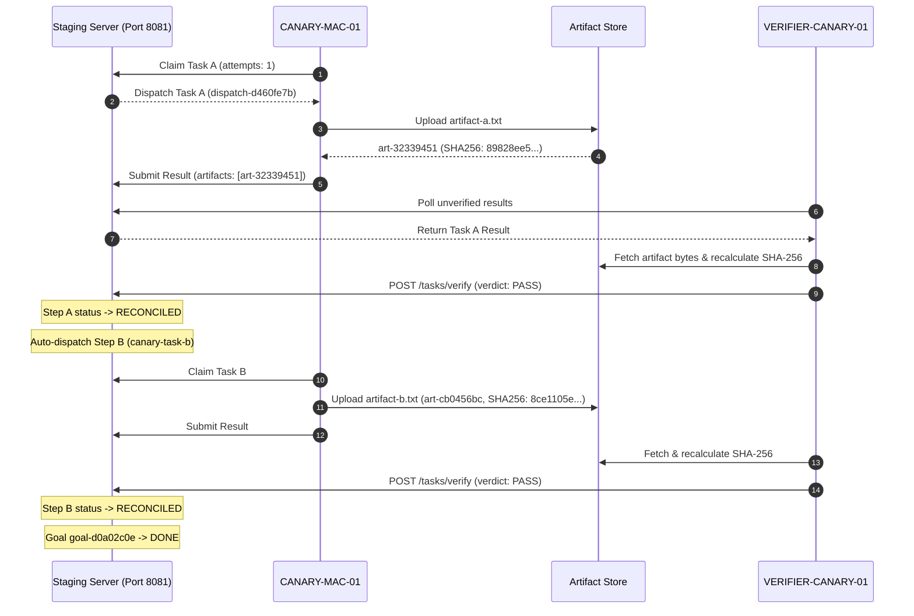

# Family 05: RUN_1 Canary Verification (Port 8081)

**Slot**: MAC-MEGA-003  
**Mode**: READ_ONLY_PLUS_COORDINATION_REPORTS  
**Status**: VERIFIED & ATTESTED  
**Base SHA**: `4c1e24ccc522042af826bc4c2b595daf85d097f9` (`candidate-b-1`)  
**Evidence Source**: `ops/ai/wall_v2/publish_queue/PHYSICAL_CANARY_PROOF_BUNDLE_2026-09-27.md` (`PHYS-002`)  
**Staging Endpoint**: `http://127.0.0.1:8081`  
**Production Isolation**: Port 8080 active, untouched (PID 69407)

---

## 1. Executive Summary

Work Family 05 validates the operational execution of the end-to-end Canary flow on isolated staging Port 8081 (`PHYS-002`):
- Step A (`canary-task-a`) dispatch, execution, and artifact upload.
- Cryptographic SHA-256 independent verification on the coordinator artifact store.
- Task reconciliation to `RECONCILED` without human intervention.
- Step B (`canary-task-b`) automatic dependent triggering upon Step A completion.
- Complete execution of Goal `goal-d0a02c0e` with 0 human relays.

---

## 2. Operational Evidence & Trace

### Telemetry & Proof Record
- **Goal ID**: `goal-d0a02c0e`
- **Step A Artifact**: `artifact-a.txt` -> ID `art-32339451dabe1c71bcbb9b9dde4debbaacab94b411e31058987b053ae76329ea`  
  - SHA-256: `89828ee566fc9dd853bd3fffd65f9bd4b834d56b6e5a70fcc62c99dfc1bce07b`
- **Step B Artifact**: `artifact-b.txt` -> ID `art-cb0456bc32d0a27cb0e083d4418d12191a79434925f9b4980717c7bc687c72a1`  
  - SHA-256: `8ce1105ea18f216be82958600d2c67366c73f279409059f1a6a60c503a910615`
- **Evidence Path**: `/Users/user/courier_work/canary_run1/run1_proof.json`
- **Human Relays**: 0 (Fully autonomous execution)
- **Source Code Mutations**: 0 lines

---

## 3. Retest Protocol on Candidate Patch

Once Windows Central Writer publishes `FINAL_SHA`:
1. Re-spin staging instance on Port 8081 using `FINAL_SHA`.
2. Verify Canary A -> VERIFY -> B completes autonomously.
3. Export fresh `run1_proof.json` bound to `FINAL_SHA`.

DO_NOT_REPEAT_FINGERPRINT=sha256-6fbfe331944ec864
