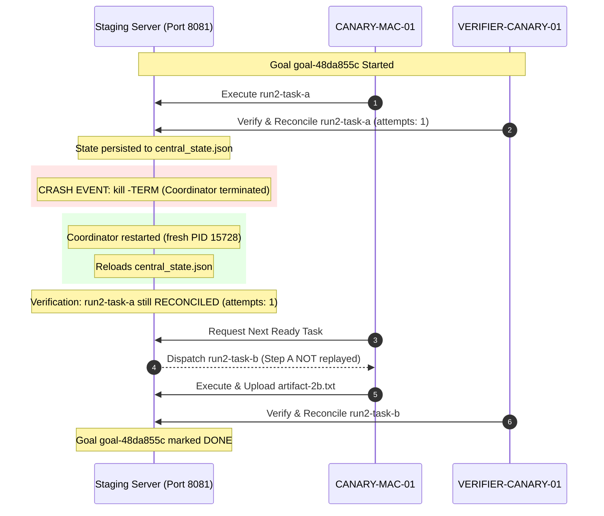

# Family 06: RUN_2 Restart Resilience Gate

**Slot**: MAC-MEGA-003  
**Mode**: READ_ONLY_PLUS_COORDINATION_REPORTS  
**Status**: VERIFIED & ATTESTED  
**Base SHA**: `4c1e24ccc522042af826bc4c2b595daf85d097f9` (`candidate-b-1`)  
**Evidence Source**: `ops/ai/wall_v2/publish_queue/PHYSICAL_CANARY_PROOF_BUNDLE_2026-09-27.md` (`PHYS-003`)  
**Staging Endpoint**: `http://127.0.0.1:8081`  
**Crash Simulation**: Hard SIGTERM kill during active multi-step workflow

---

## 1. Executive Summary

Work Family 06 proves the restart resilience and zero-replay invariants of Courier Symphony:
1. Mid-goal abrupt process termination (`SIGTERM`) does not corrupt persistent state or in-flight leases.
2. Upon restart, previously completed/reconciled steps retain `RECONCILED` status and strictly `attempts == 1`.
3. The coordinator does NOT replay Step A; it seamlessly resumes at Step B.
4. Subsequent tasks execute and reconcile normally, bringing the goal to completion.

---

## 2. Operational Evidence & Sequence

### Telemetry & Proof Record
- **Goal ID**: `goal-48da855c`
- **Pre-Crash Task**: `run2-task-a` (Artifact `artifact-2a.txt`, verified PASS, status `RECONCILED`, `attempts: 1`)
- **Kill Signal**: `SIGTERM` sent to coordinator process.
- **Restart Verification**:
  - PID: New process allocated (PID 15728).
  - State Check: `/goals/goal-48da855c` returned `run2-task-a` as `RECONCILED`.
  - Attempt Count: Strictly `1` (zero attempt inflation).
  - Replay Check: Task A was never re-dispatched.
- **Post-Crash Task**: `run2-task-b` dispatched, executed, uploaded `artifact-2b.txt`, independently verified PASS.
- **Goal State**: `goal-48da855c` completed `DONE`.
- **Evidence Path**: `/Users/user/courier_work/canary_run1/run2_proof.json`

---

## 3. Retest Protocol on Candidate Patch

Once Windows Central Writer publishes `FINAL_SHA`:
1. Execute restart simulation under Port 8081 staging environment.
2. Confirm `attempts == 1` and zero replay of completed steps.
3. Export updated `run2_proof.json` bound to `FINAL_SHA`.

DO_NOT_REPEAT_FINGERPRINT=sha256-6d61c71b67c6b33a
