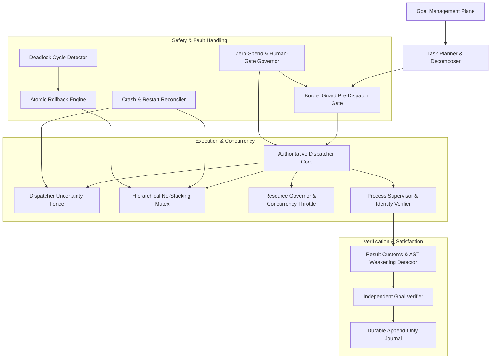

# DEPENDENCY GRAPH: COURIER ARCHITECTURE

### Critical Dependency Rules
1. **Dispatcher Dominance**: No task execution may bypass `BorderGuard`, `Fence`, and `Mutex`.
2. **Reconciliation Priority**: On restart, `Reconciler` must run before any new task dispatch.
3. **Rollback Preemption**: Deadlock resolver triggers `Rollback` which cleanly releases `Mutex` leases before re-enqueuing tasks.
4. **Independent Satisfaction**: `Goal` state updates only after `Verifier` validates deliverable hashes against `Journal` events.
