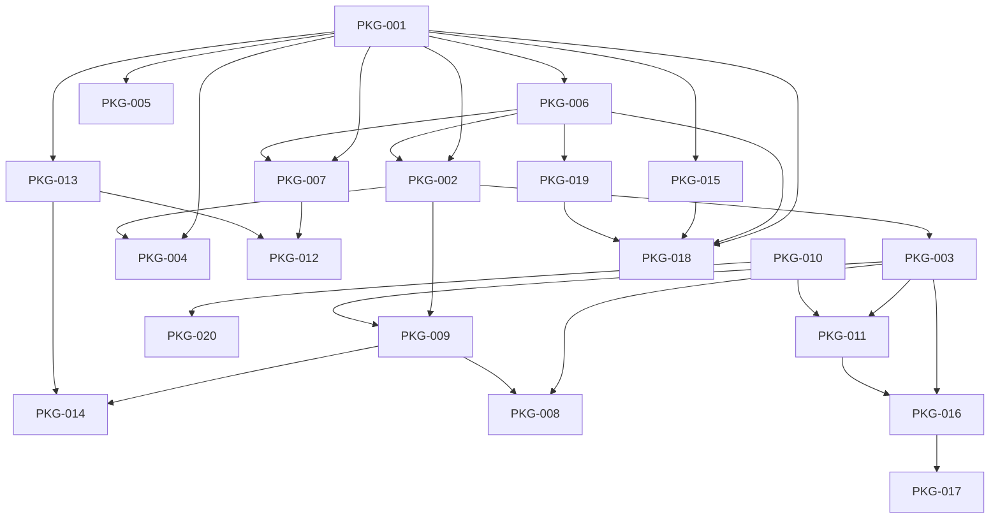

# INTEGRATION DAG — V3

### Topological Order:
1. **PKG-001**
2. **PKG-010**
3. **PKG-006**
4. **PKG-005**
5. **PKG-013**
6. **PKG-015**
7. **PKG-020**
8. **PKG-002**
9. **PKG-007**
10. **PKG-019**
11. **PKG-003**
12. **PKG-004**
13. **PKG-012**
14. **PKG-018**
15. **PKG-009**
16. **PKG-011**
17. **PKG-014**
18. **PKG-008**
19. **PKG-016**
20. **PKG-017**
